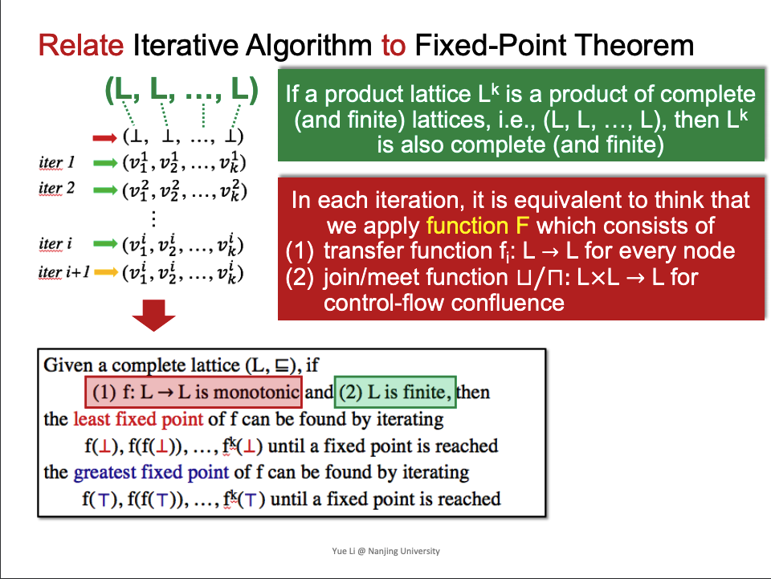
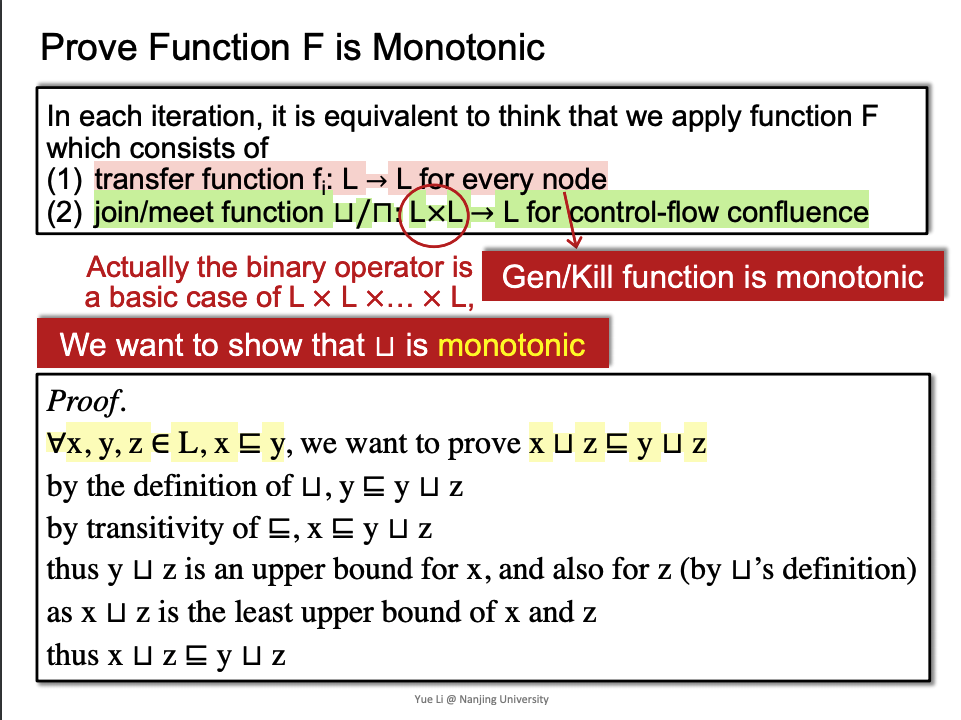
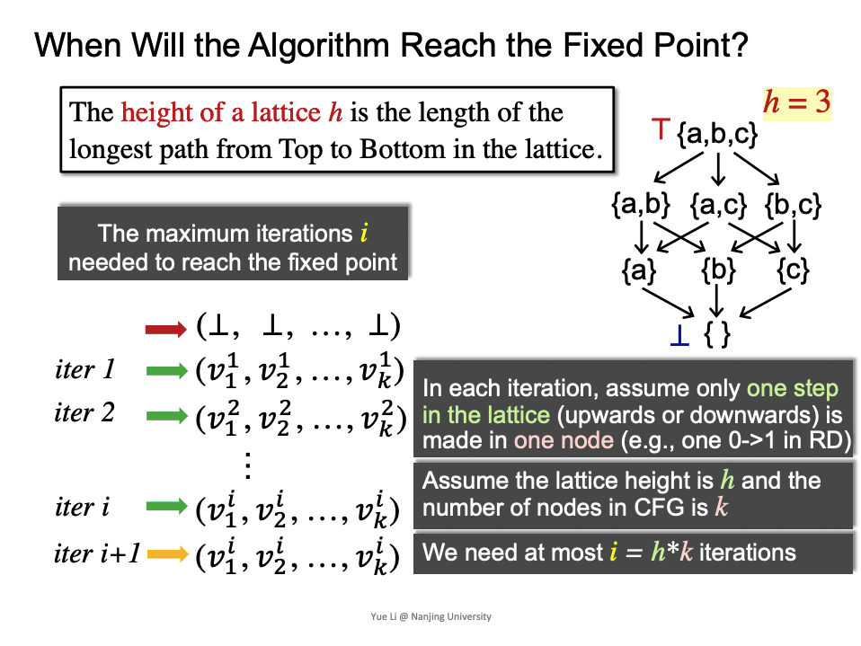
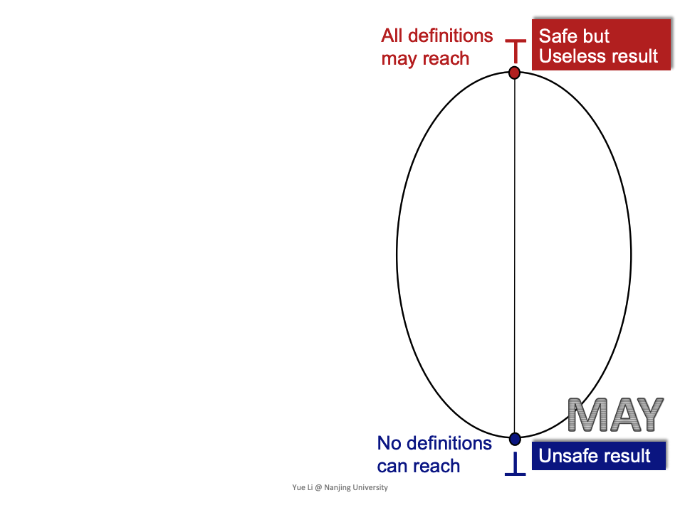
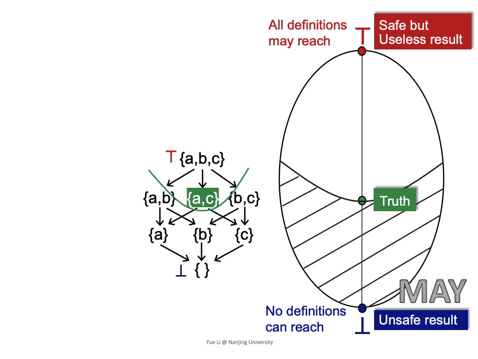
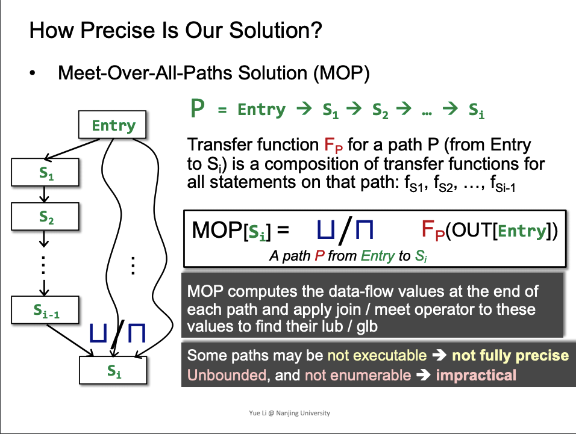
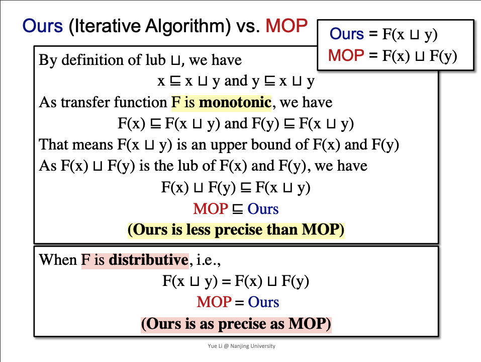
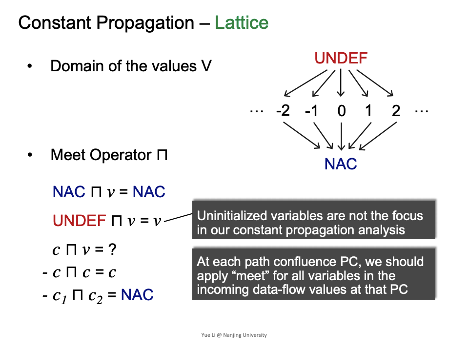
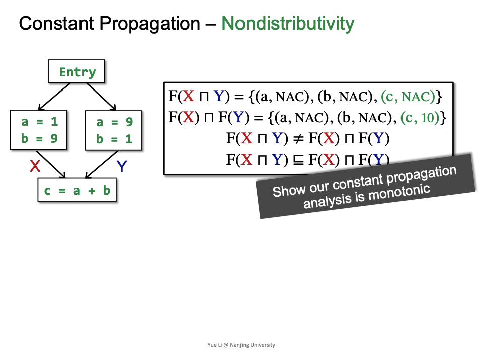
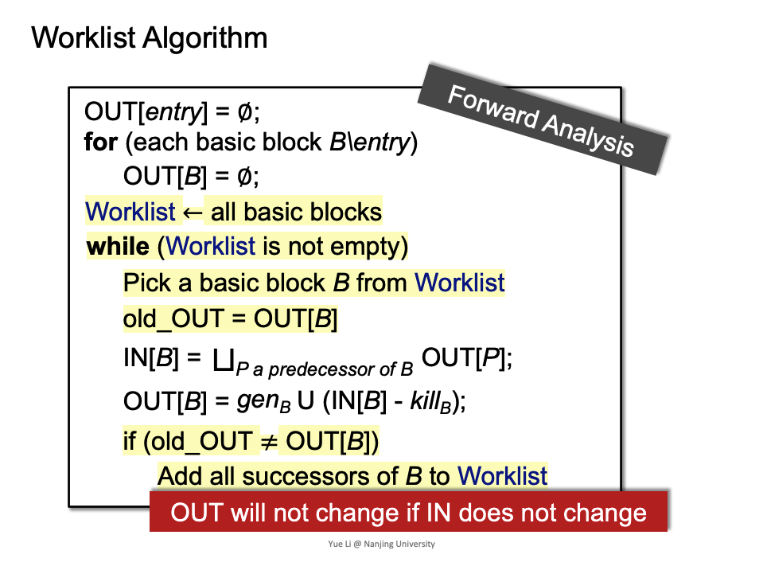

- [Data Flow Analysis Foundations II](#head1)
	- [Relate Iterative Algorithm to Fixed Point Theorem](#head2)
		- [ 格与迭代算法对应](#head3)
		- [ 证明迭代算法中F的monotonic](#head4)
		- [ 什么时候到达fixed-point](#head5)
	- [May/Must Analysis, A Lattice View](#head6)
	- [Mop and Distributivity](#head7)
		- [ mop定义](#head8)
		- [ mop与迭代算法区别](#head9)
	- [Constant Propagation](#head10)
		- [非distributive的问题，must analysis](#head11)
		- [ 问题映射到lattice上](#head12)
	- [Worklist Algorithm](#head13)
# Data Flow Analysis Foundations II

## Relate Iterative Algorithm to Fixed Point Theorem

###  格与迭代算法对应

对应关系主要关注，对应fixed-point theorem：
- finite lattice( complete lattice)
- monotonic

迭代算法的抽象:
- 由k个cfg中node对应的k-tuple生成格
- 对于迭代的F，分为
  - transfer function
  - control flow上的 merge操作

###  证明迭代算法中F的monotonic

- gen/kill fun是monotonic

- merge 的join是monotonic。(meet没证明)

###  什么时候到达fixed-point

每一个node上的格，最多是该格的高度h。再加上k-tuple的k。生成格上为h*k

## May/Must Analysis, A Lattice View

通过Reaching Definition来理解may analysis，may analysis从bottom到top，对应从unsafe result到safe result，对与Reaching Definition来说unsafe result就是 no definitons can reach，这样的开始对于应用来说是不安全的(没有任何一个definitions可达，导致所有的变量都被提前释放)。然后向safe result(所有的都不释放)，approximate。

safe的范围，也就是sound的范围。

用于理解may/must在格上

## Mop and Distributivity

###  mop定义

###  mop与迭代算法区别

- 迭代算法精度小于mop
- F为可分配，则精度相同
- Bit-vector or Gen/Kill problems(set union/intersection for join/meet) are distributive

## Constant Propagation

### 非distributive的问题，must analysis

###  问题映射到lattice上

问题(围绕怎么把这个问题映射到lattice上的数学问题，且需要脱离之前讲的bit vector上与该问题的迁移的思想):

- finite lattice
  - UNDEF -∞ ... -1 0 1 ... +∞，这个是finite的吗？还是lattice的高度是finite的就可以?
- monotonic
  - transfer func、merge是单调的吗？

- UNDEF ∩ v = v 怎么理解?
- node上的vector数据结构表示，可以是{{V1:Z1},{V2:Z2},....{Vn:Zn}}，z ∈ { -∞ ... -1 0 1 ... +∞}吗？

- 不可分配
- mop更准

## Worklist Algorithm

优化掉迭代算法中没有input变化的BB