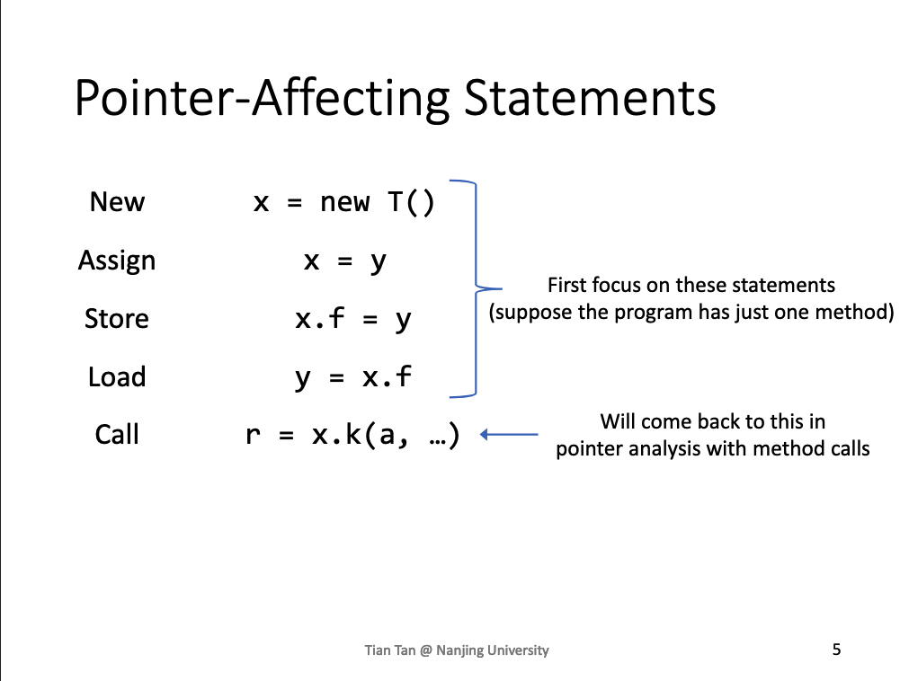
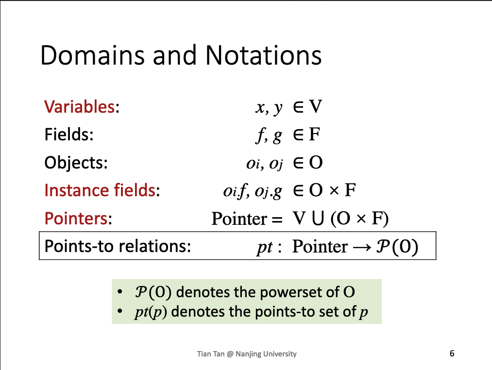
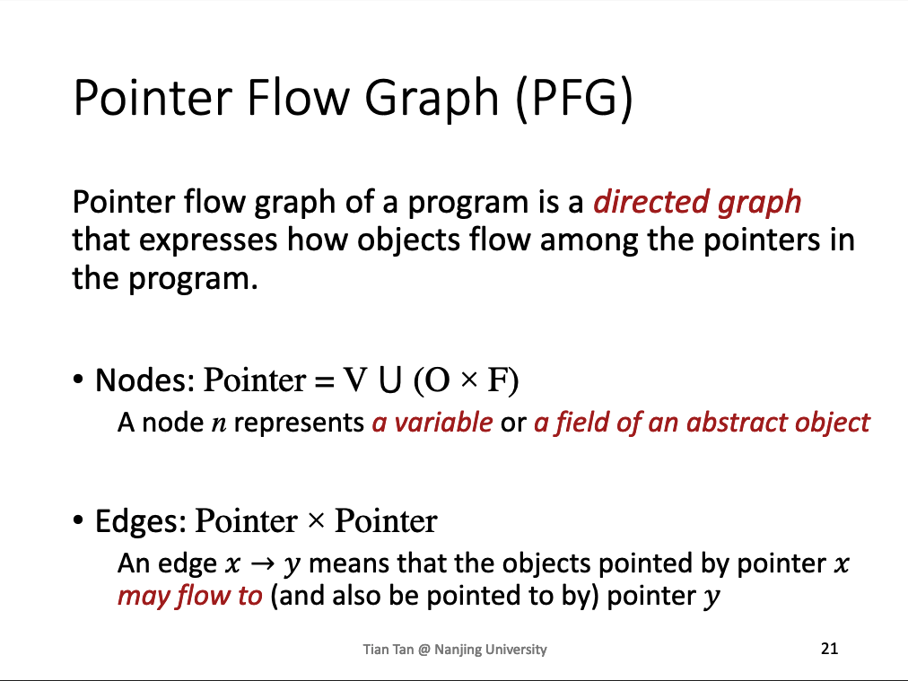
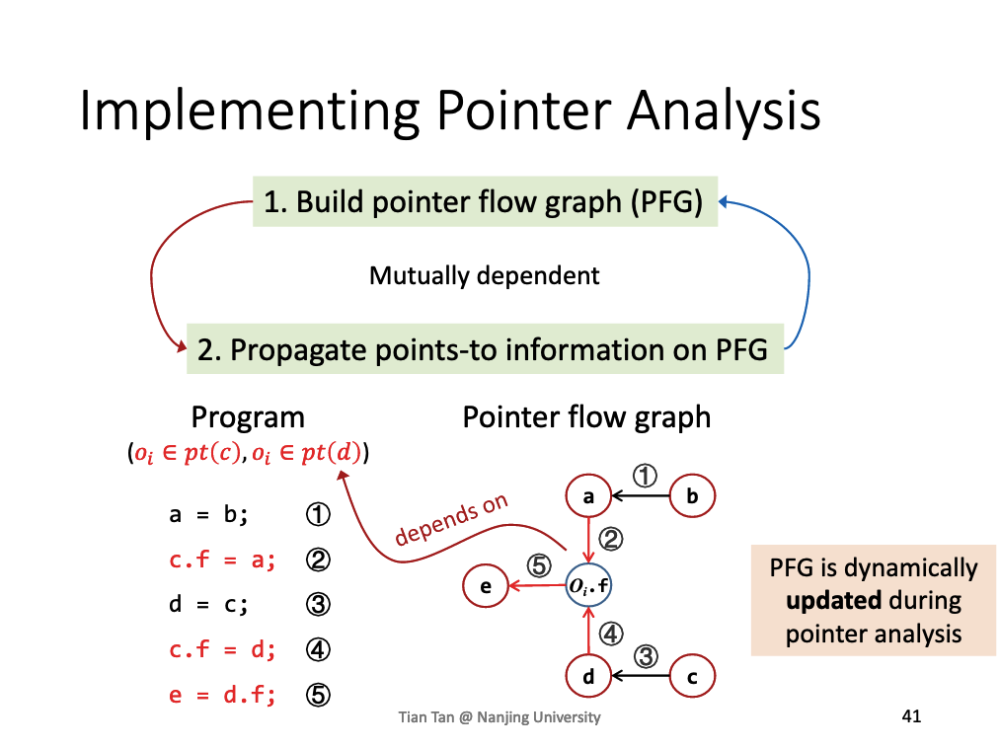
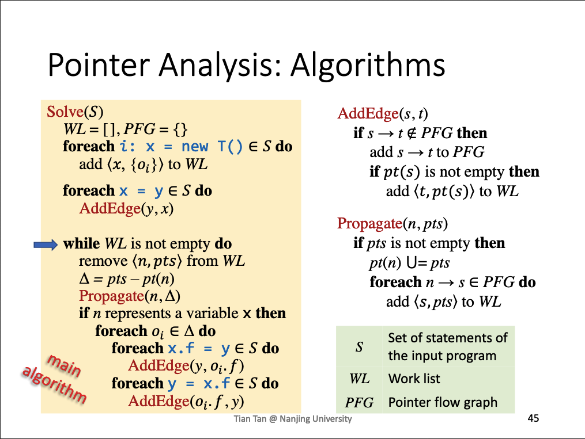

- [Pointer Analysis - Foundations I](#head1)
	- [Pointer Analysis:Rules](#head2)
		- [ 影响指针的statements](#head3)
		- [Domains and Notations](#head4)
		- [ Rule](#head5)
	- [How to implement Pointer Analysis](#head6)
		- [ PFG](#head7)
		- [实现Pointer Analysis](#head8)
	- [Pointer Analysis:Algorithms](#head9)
# Pointer Analysis - Foundations I

## Pointer Analysis:Rules

###  影响指针的statements

### Domains and Notations

powerset of O，就是所有对象的所有子集组成的集合

###  Rule

## How to implement Pointer Analysis

###  PFG

### 实现Pointer Analysis

## Pointer Analysis:Algorithms

