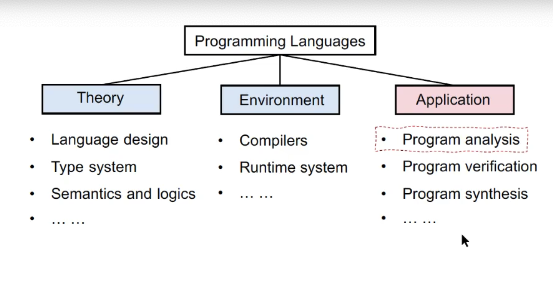
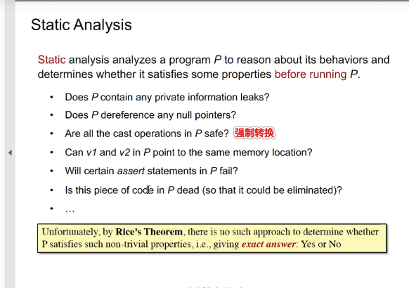
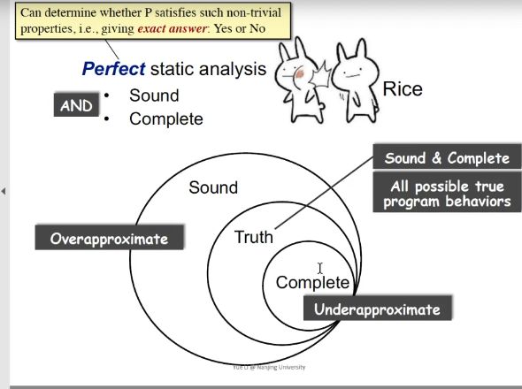
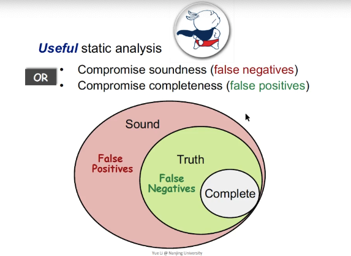
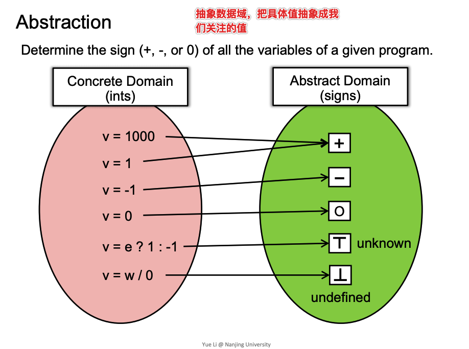
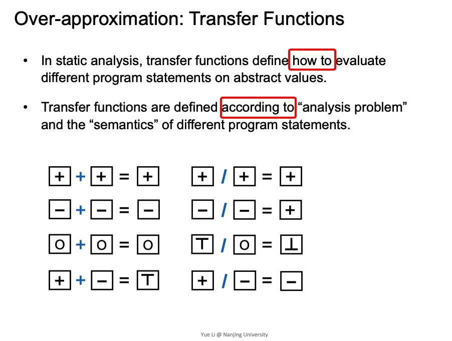
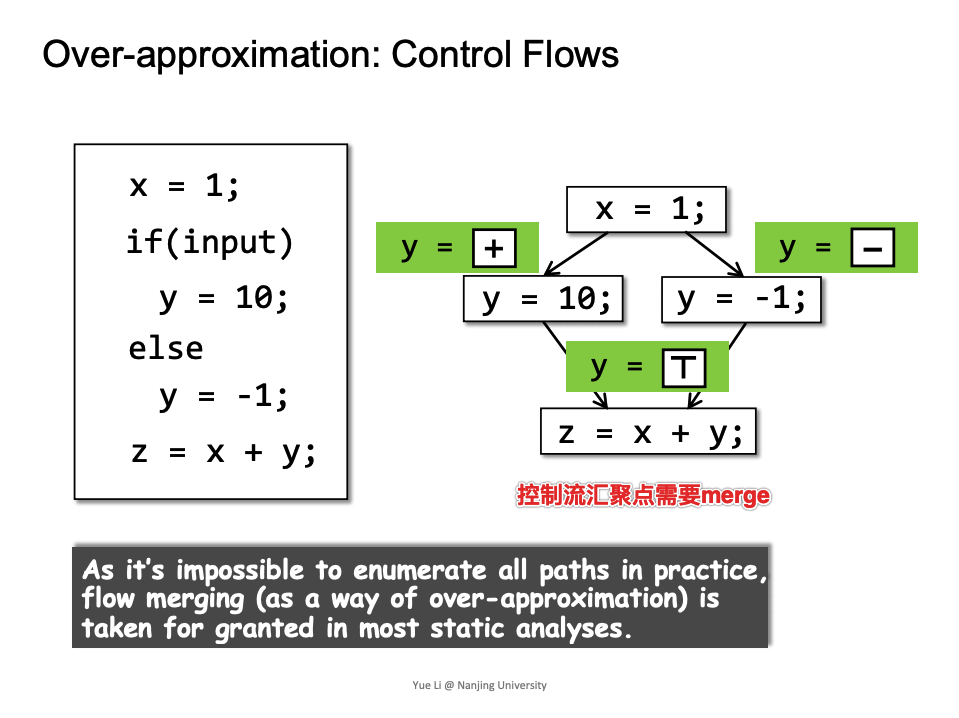
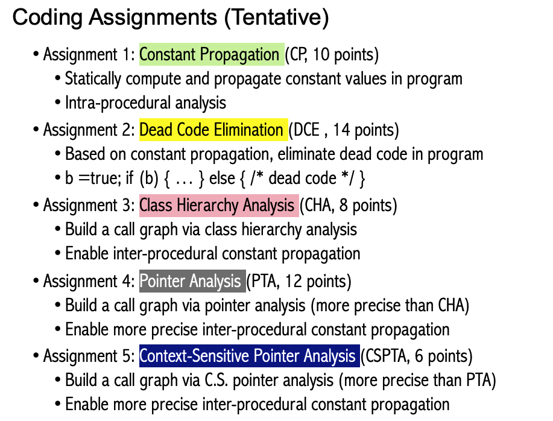

- [Course Introduction](#head1)
	- [PL and Static Analysis](#head2)
	- [Why We Lean Static Analysis](#head3)
	- [What is Static Analysis](#head4)
	- [Static Analysis Features and Examples](#head5)
		- [ soundness](#head6)
		- [ 如何实现](#head7)
		- [ 一个栗子](#head8)
		- [ 精度与速度平衡](#head9)
	- [Teaching Plan](#head10)
	- [Evalution Criteria](#head11)
# Course Introduction

## PL and Static Analysis

图.1-1.程序分析在PL中的位置

## Why We Lean Static Analysis

## What is Static Analysis

图.1-2.静态分析定义

Rice's theorem表示，静态分析对于一些有意义的分析，不能得出 exact answer  

## Static Analysis Features and Examples

###  soundness

图.1-3.Sound、Complete关系

Rice's Theorem对于non-trivial properties不存在精确答案。所以就有了sound、complete两个概念。  

因为不存在exact answer，所以有两个选择：
- 妥协soundness，存在漏报
- 妥协compeleness，存在误报

静态分析一般的应用是compromise completeness的，及是sound的，可以有误报，但不能漏报。比如做一些bug的检测，宁可信其有，不可信其无，限定可能范围，排查错误。

###  如何实现
在技术上实现 : Abstraction + Over-approximation
- Abstraction   抽象数据域
- Over-approximation   
  - Transfer functions 抽象数据在语句的转换
  - Control flows 抽象数据在控制流上的转换  

###  一个栗子

###  精度与速度平衡
Static analysis:ensure(or get close to)soundness, while making good trade-offs between analysis precision and analysis speed.

## Teaching Plan

## Evalution Criteria
