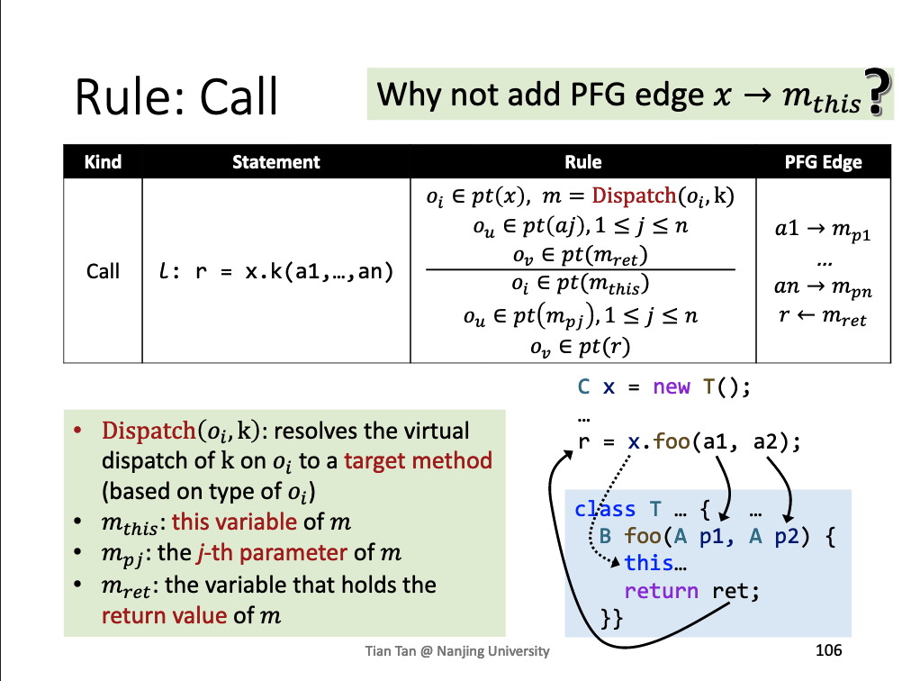
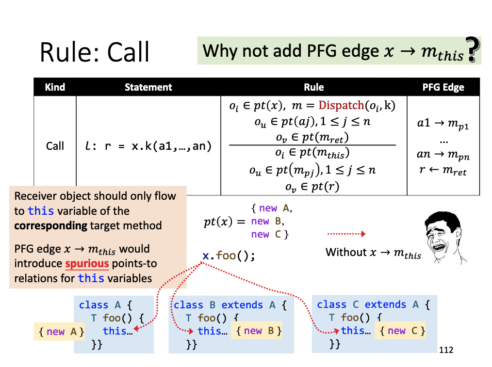
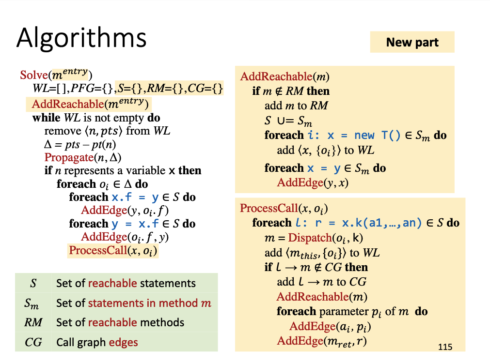

- [Pointer Analysis with Method Calls](#head1)
	- [call rule](#head2)
	- [ 不加x到this](#head3)
	- [Interprocedure Pointer Anaylsis Algorithm](#head4)
# <span id="head1">Pointer Analysis with Method Calls</span>

## <span id="head2">call rule</span>


## <span id="head3"> 不加x到this</span>


## <span id="head4">Interprocedure Pointer Anaylsis Algorithm</span>
```
AddEdge(s,t)
   if s-> t ∉ PFG then
       add s->t to PFG
       if pt(s) is not empty then 
           add<t,pt(s)> to WL
```

