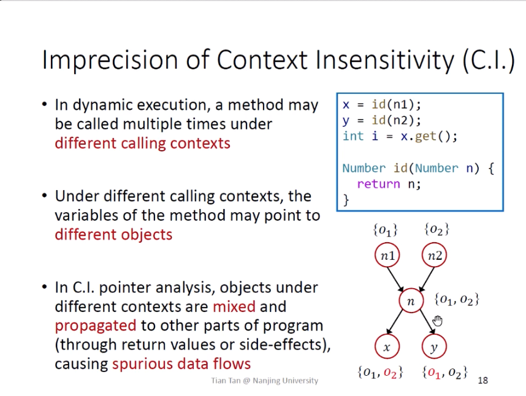
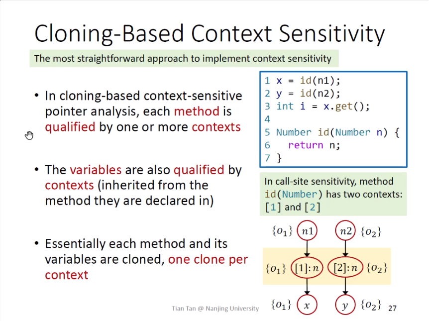
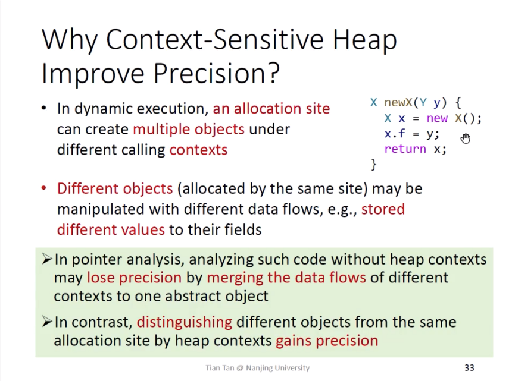
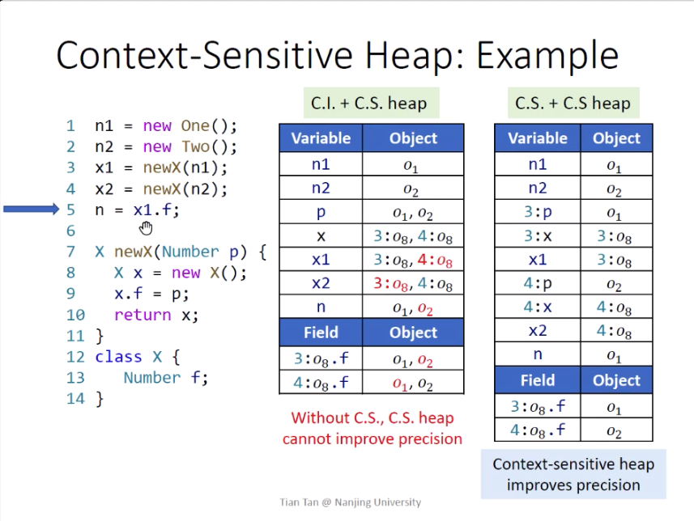
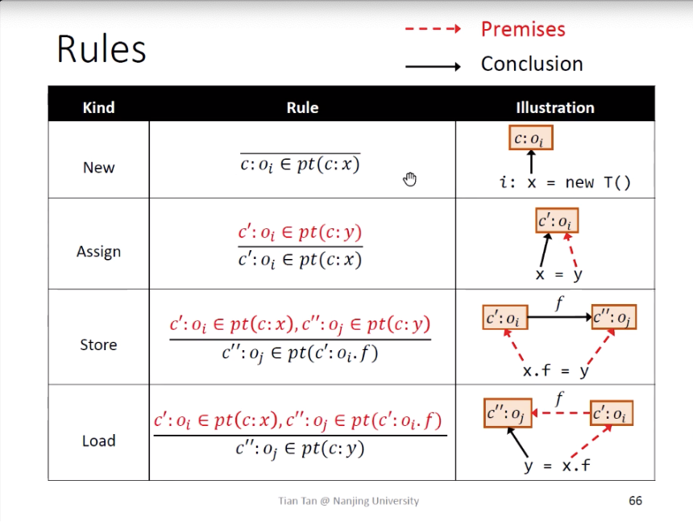
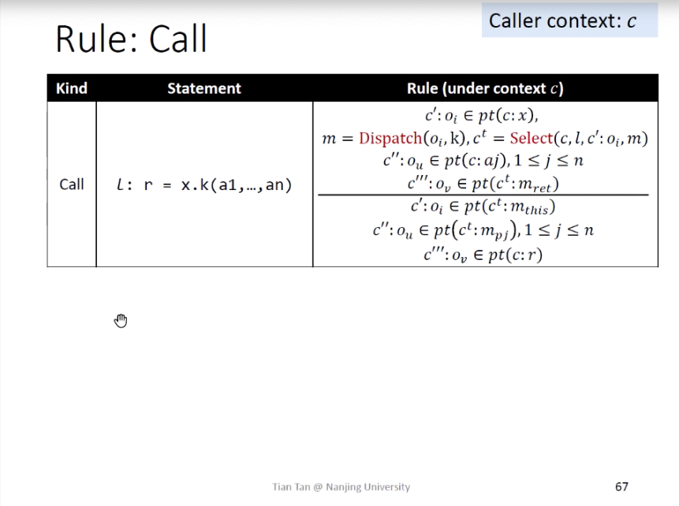

- [Pointer Analysis Context Sensitivity](#head1)
	- [ Introduction](#head2)
		- [Why Context Sensitivity](#head3)
		- [Cloning-Based Context Sensitivity](#head4)
		- [Why  Context-Sensitive Heap](#head5)
		- [Context-Sensitive Heap](#head6)
	- [Context Sensitive Pointer Analysis:Rules](#head7)
		- [Domains and Notations](#head8)
	- [ Rules](#head9)
# Pointer Analysis Context Sensitivity

##  Introduction

### Why Context Sensitivity

### Cloning-Based Context Sensitivity

### Why  Context-Sensitive Heap

### Context-Sensitive Heap

## Context Sensitive Pointer Analysis:Rules

### Domains and Notations

##  Rules

