- [Pointer Analysis Context Sensitivity II](#head1)
	- [Context Sensitive Pointer Analysis : Algorithms](#head2)
		- [ 定义](#head3)
		- [ algorithms](#head4)
	- [Context Sensitivity Variants](#head5)
		- [Call-Site Sensitivity](#head6)
			- [ 栗子](#head7)
		- [Object Sensitivity](#head8)
			- [ 栗子](#head9)
		- [Type Sensitivity](#head10)
		- [ 对比](#head11)

# <span id="head1">Pointer Analysis Context Sensitivity II</span>

## <span id="head2">Context Sensitive Pointer Analysis : Algorithms</span>

### <span id="head3"> 定义</span>
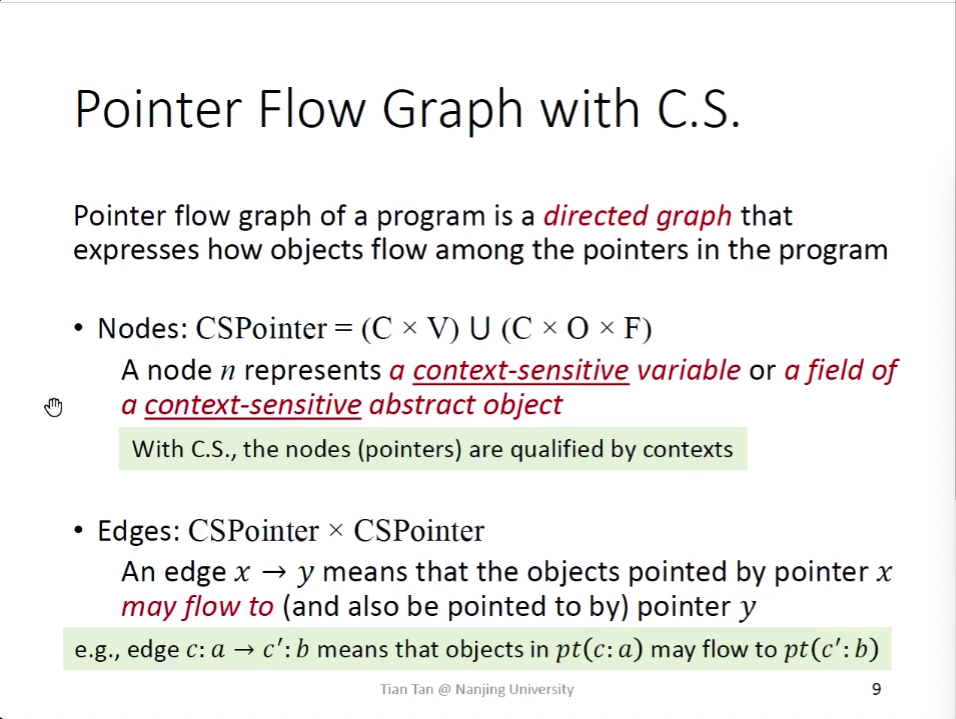

### <span id="head4"> algorithms</span>
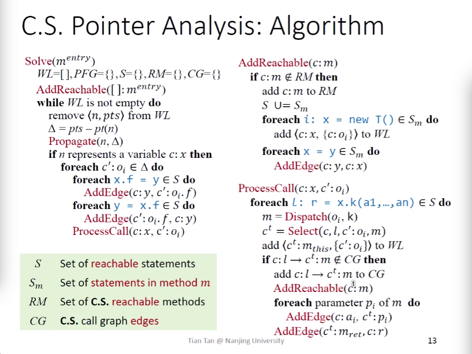

```
AddEdge(s,t)
    if s -> t ∉ PFG then
        add s -> t to PFG
        if pt(s) is not empty then
            add<t,pt(s)> to WL
Propagate(n,pts)
    if pts is not empty then
        pt(n) ∪= pts
       	foreach n->s ∈ PFG do
       	    add <s,pts> to WL
```


## <span id="head5">Context Sensitivity Variants</span>

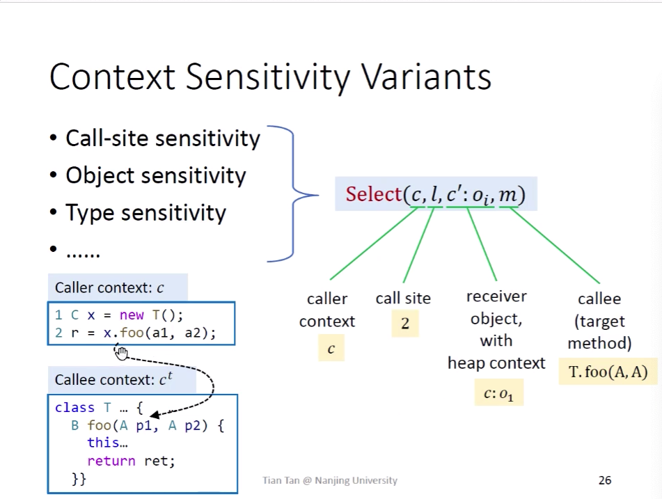

```
context insensitivity可以看作是context sensitivity的特殊情况:
 Select(c,l,c':oi,m) = [], 即所有的上下文都相等
```

### <span id="head6">Call-Site Sensitivity</span>
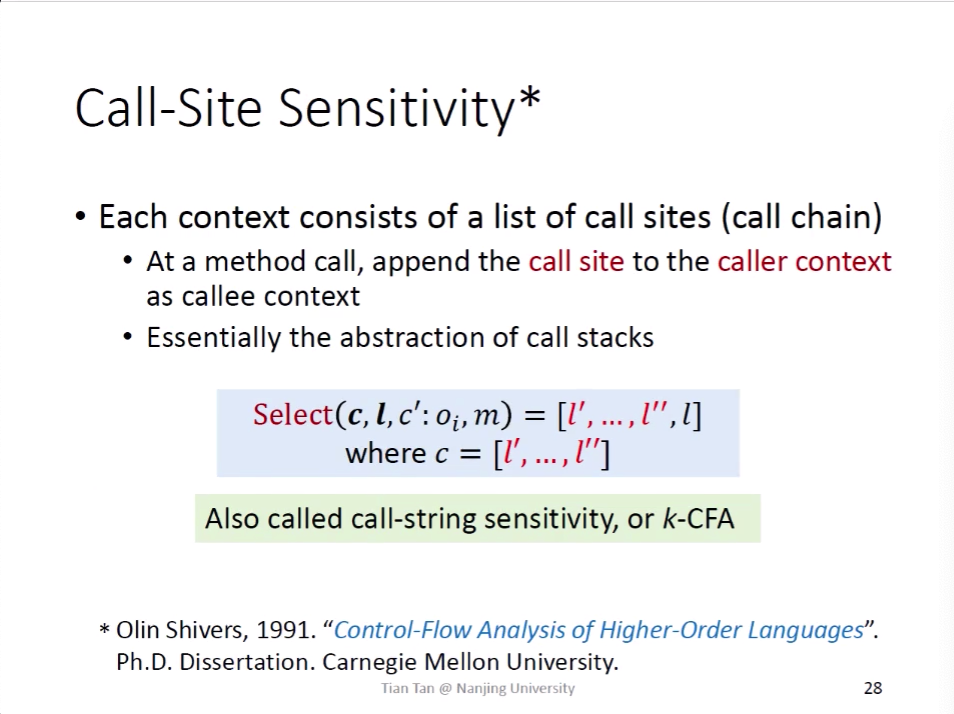
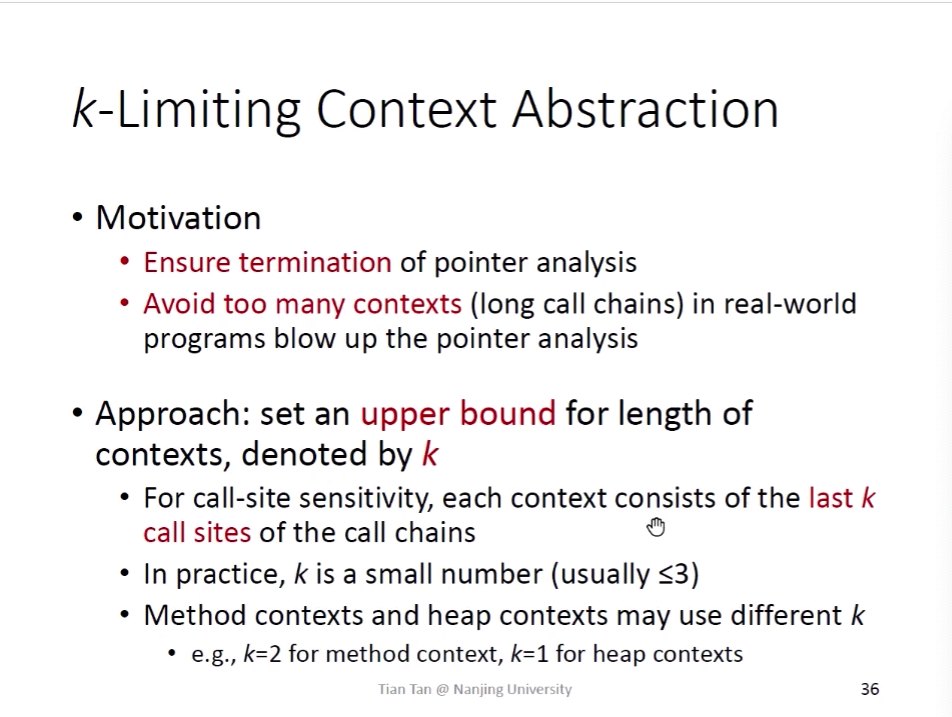
对于Call-Site Sensitivity来说，如果存在递归，会导致上下文无穷长，无穷多，所以要限制上下文长度。

#### <span id="head7"> 栗子</span>
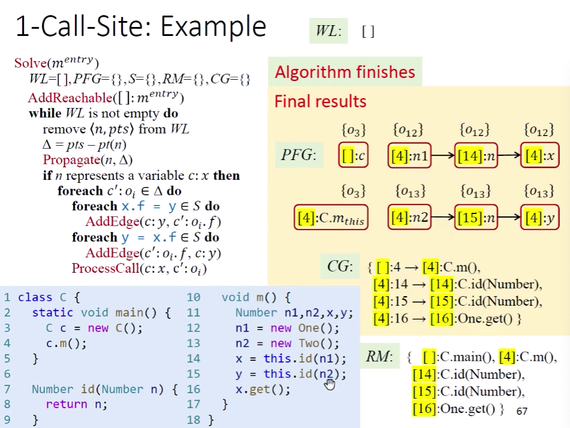

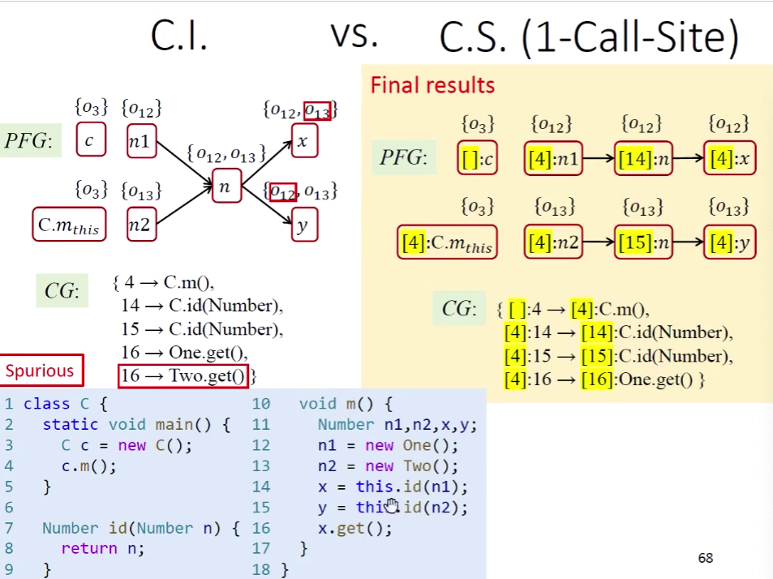
从这个栗子里面，可以思考到一些点，其实context的有与无，其实就是该函数调用，被抽象成了相同的path还是不同的path。就是一个把path数据合并与分开的操作。
再比如对于for循环，每一次迭代，都可以分成不同的path，但是我们仍然可以选择合并、或是分开。
合并意味着牺牲精度，来满足速度，或是抽象无穷多的path来达到可以完成计算。

### <span id="head8">Object Sensitivity</span>
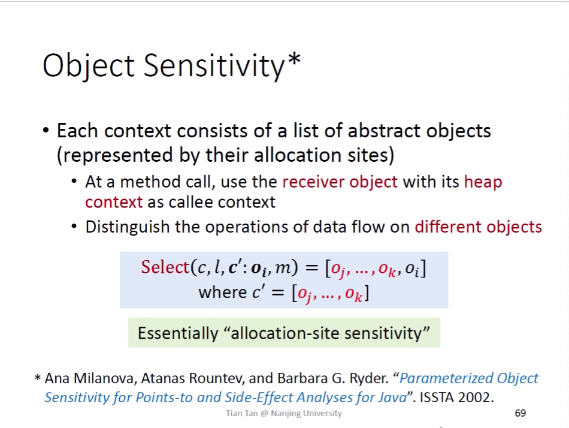

#### <span id="head9"> 栗子</span>
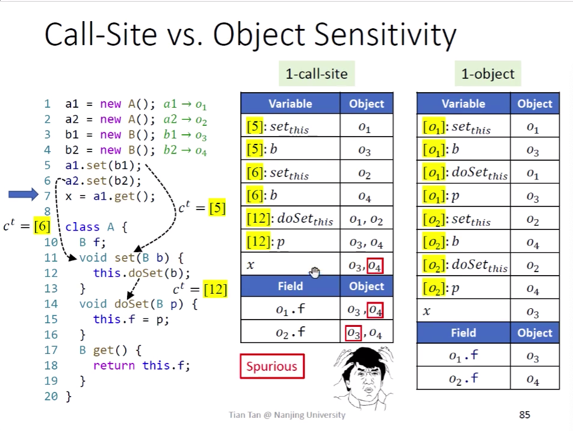

对于这个栗子，1 call-site context没办法区分两个调用

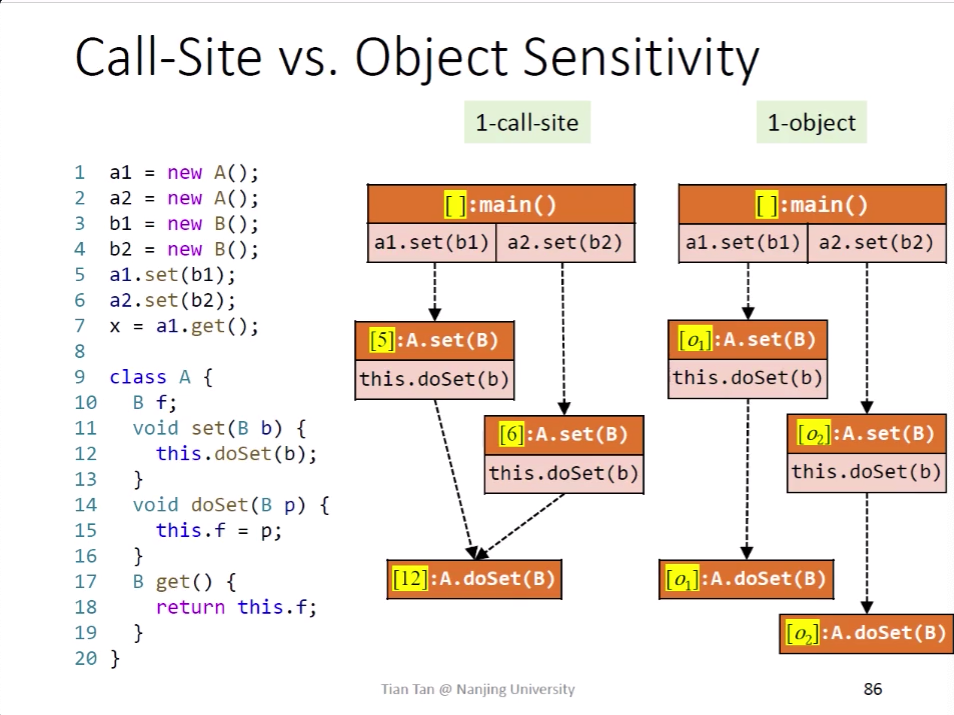

从CG上来看

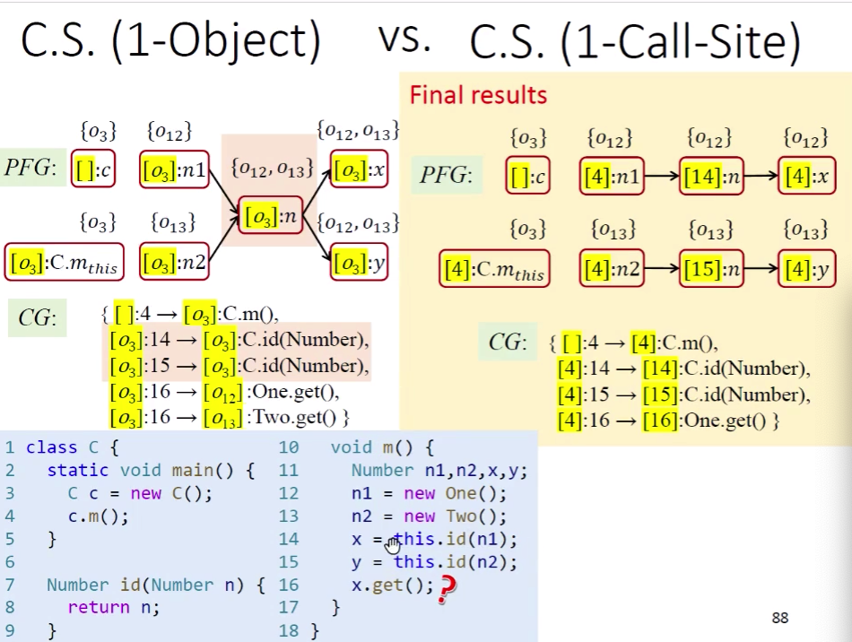

对与这个栗子，1 object sensitivity不能区分

### <span id="head10">Type Sensitivity</span>
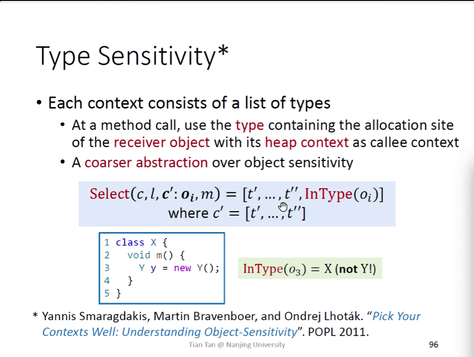
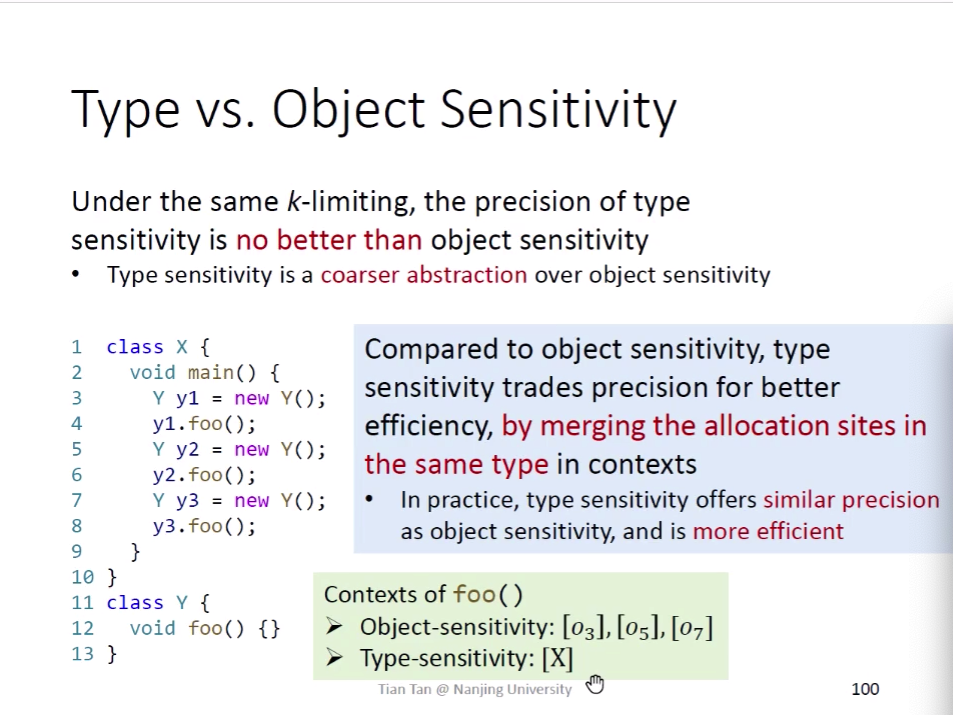
对于与Object Sensitivity，性价比较高

### <span id="head11"> 对比</span>
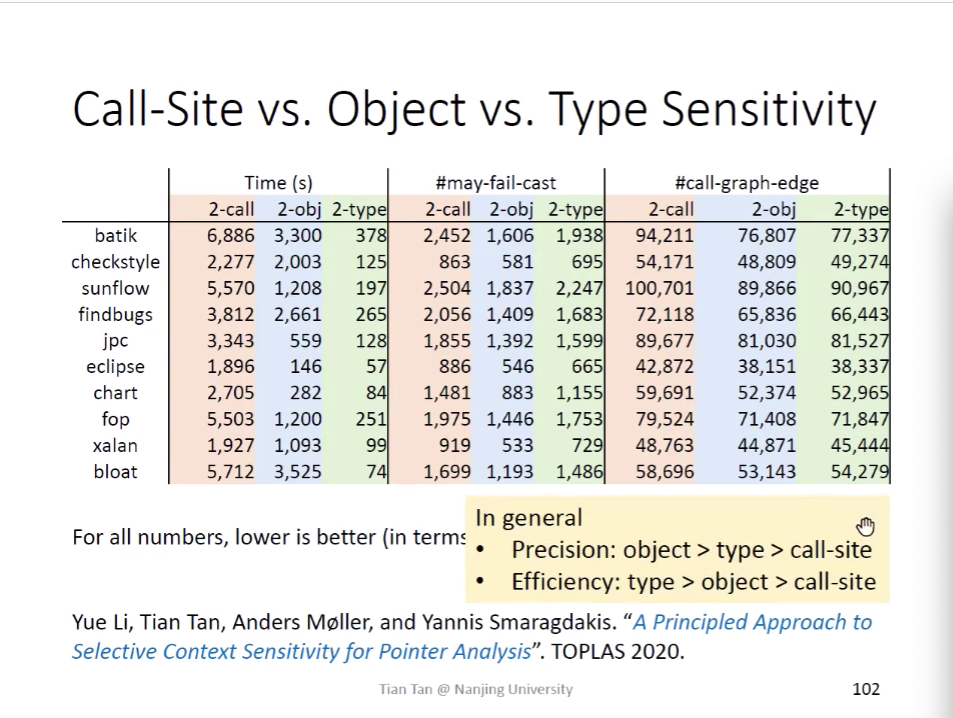
call-graph-edge越少，表示越精确(误报的边少)。
may-fail-cast越高，精度越低。
有些调用并不需要cs，可以ci既能满足需求，具体读老师论文