- [Static Analysis for Security](#head1)
	- [Information Flow Security](#head2)
		- [Access Control vs. Information Flow Security](#head3)
		- [Security Levels](#head4)
		- [Information Flow Policy](#head5)
	- [Confidentiality and Integrity](#head6)
		- [Confidentiality vs. Integrity](#head7)
		- [Integrity, Broad Definition](#head8)
	- [Explicit Flows and Covert Channels](#head9)
		- [Implicit Flow](#head10)
		- [Covert Channels](#head11)
	- [Taint Analysis](#head12)
		- [ 定义](#head13)
		- [ 解决confidentiality、Integrity](#head14)
		- [Taint 与Pointer Analysis结合](#head15)
		- [Domains and Notations](#head16)
		- [Taint Analysis Input & Output](#head17)
		- [Taint analysis:rule](#head18)
	- [ 其他](#head19)
# Static Analysis for Security

## Information Flow Security

### Access Control vs. Information Flow Security
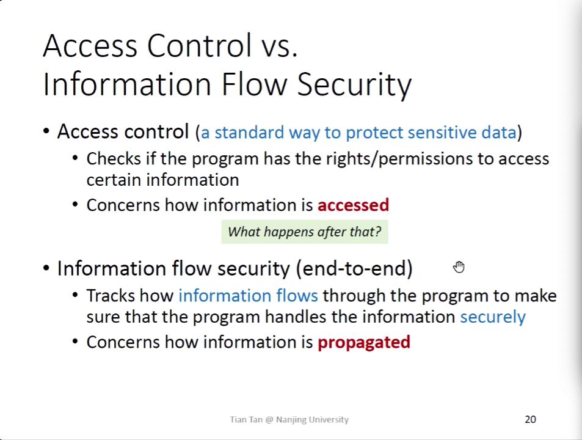
通过两个行为，控制程序的安全性：对数据标记访问控制等级、通过信息流控制信息流动。点与端到端的控制。

### Security Levels
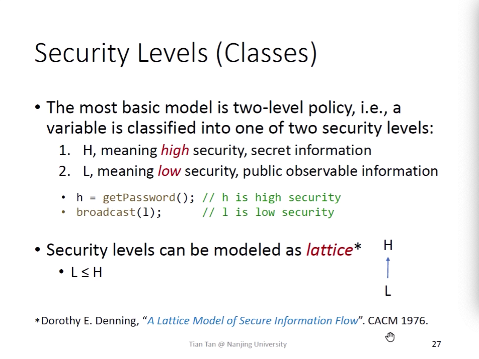
可以通过格来描述安全等级之间的关系

### Information Flow Policy
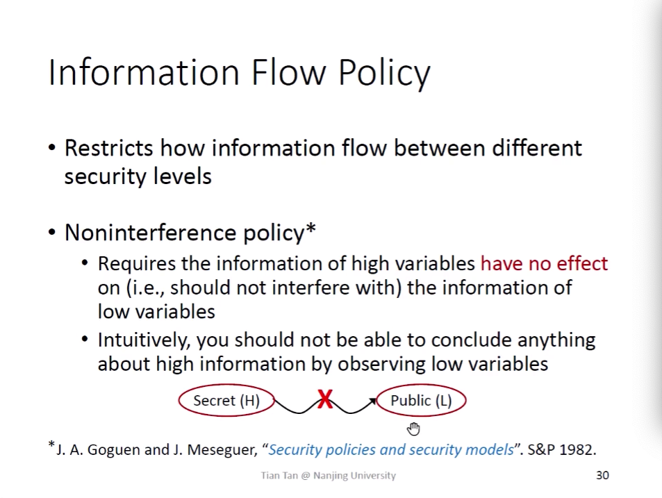

## Confidentiality and Integrity

### Confidentiality vs. Integrity
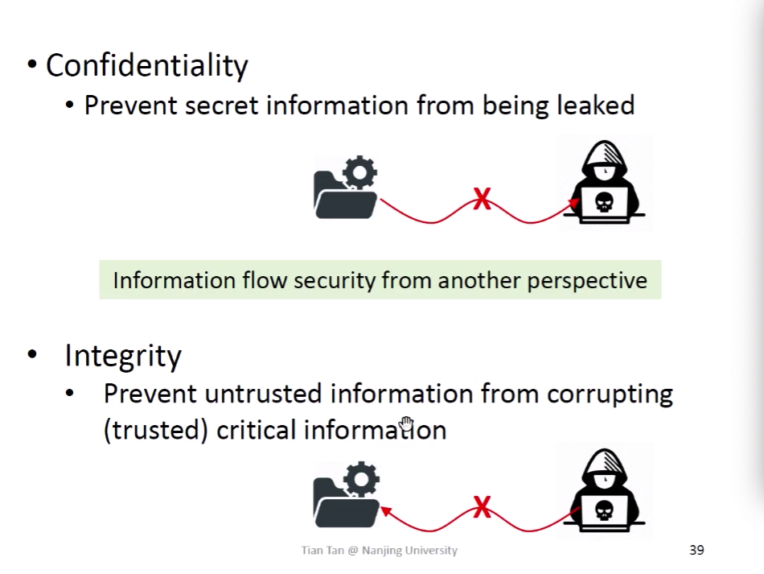
confidentiality，防止h数据流向l，防止h数据被窥。Integrity，防止l数据流向h数据，h数据被污染。
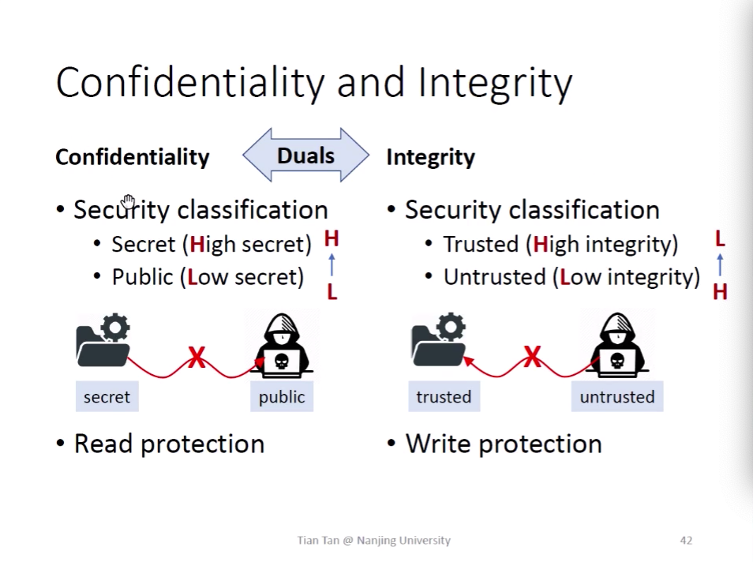
两者在格上的关系是对称的。

### Integrity, Broad Definition
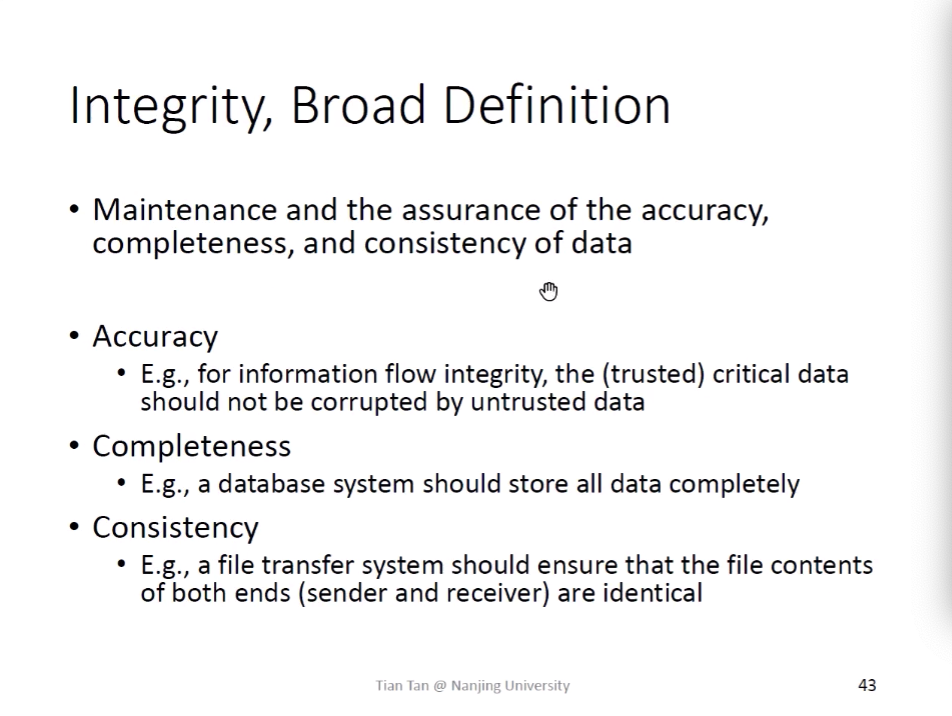

## Explicit Flows and Covert Channels

### Implicit Flow
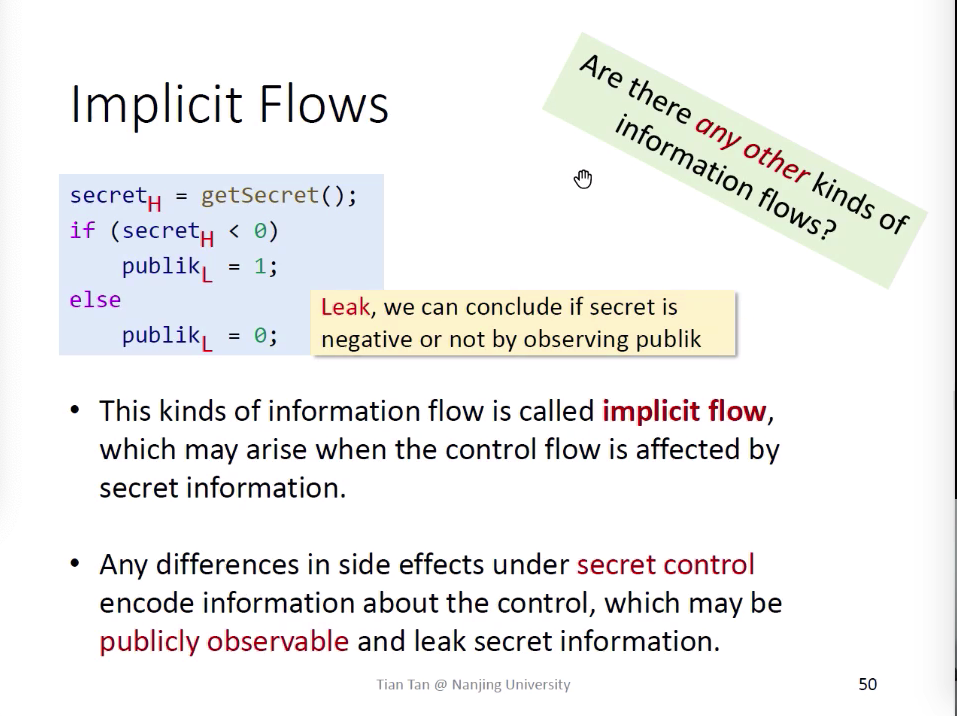

### Covert Channels
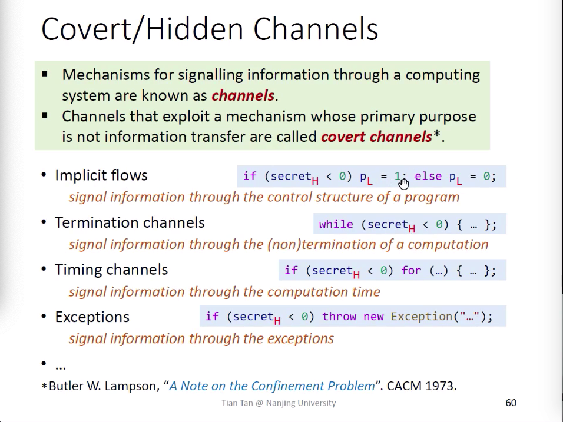

Blind Time Base SQLI 

## Taint Analysis

###  定义
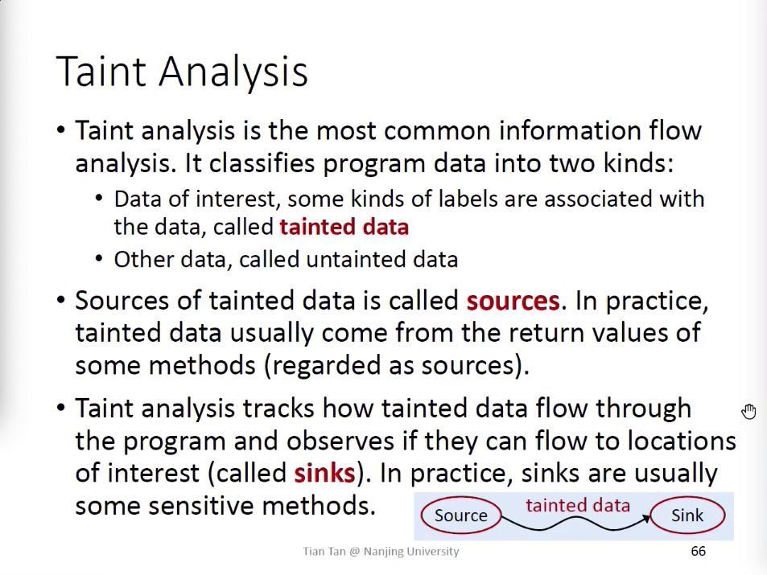

###  解决confidentiality、Integrity
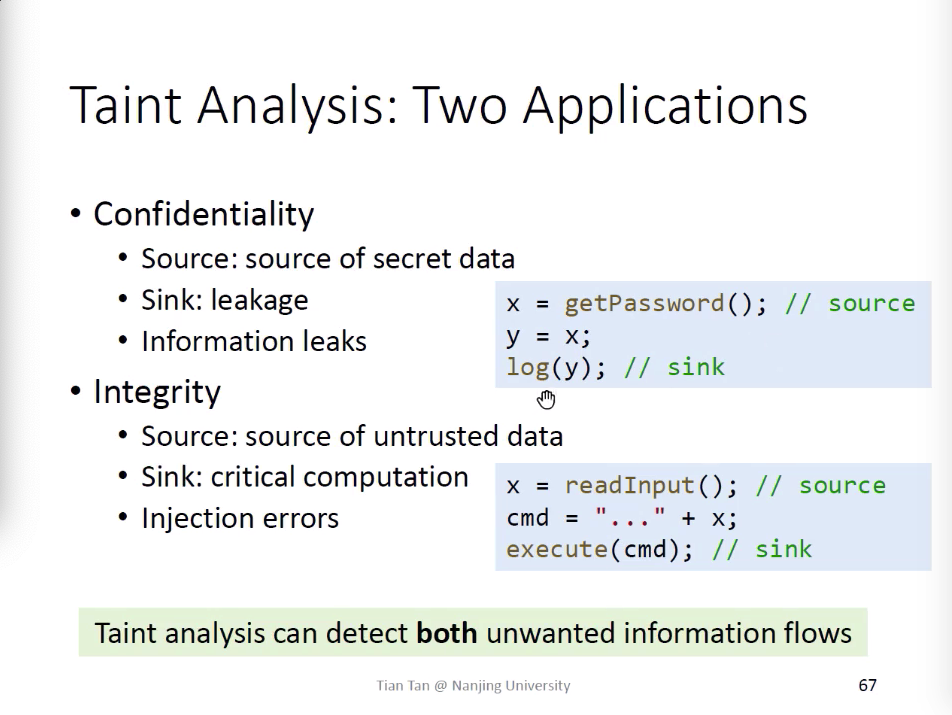

### Taint 与Pointer Analysis结合
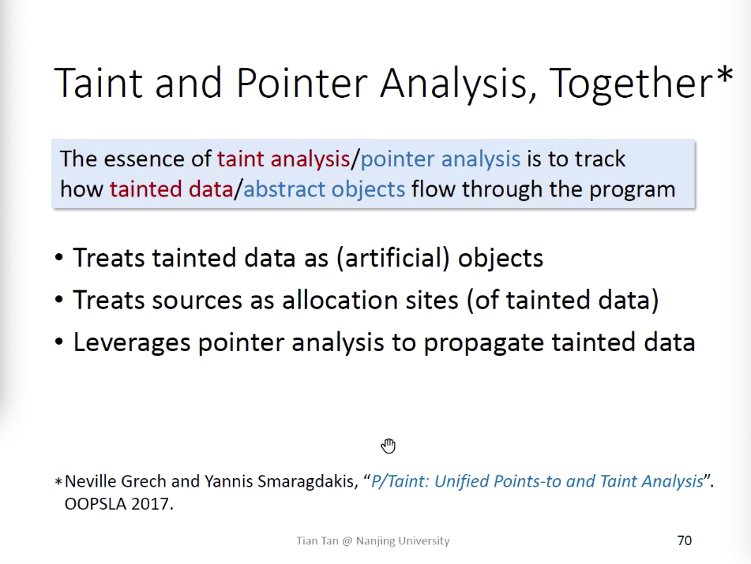

### Domains and Notations
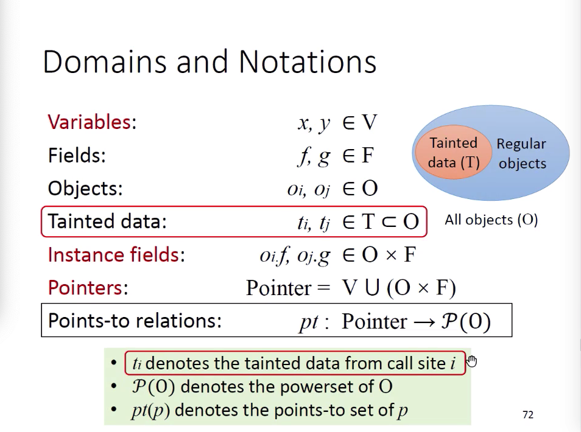
对于普通的对象oi集合，添加了一种taint类型的对象，在指针间传播。

### Taint Analysis Input & Output
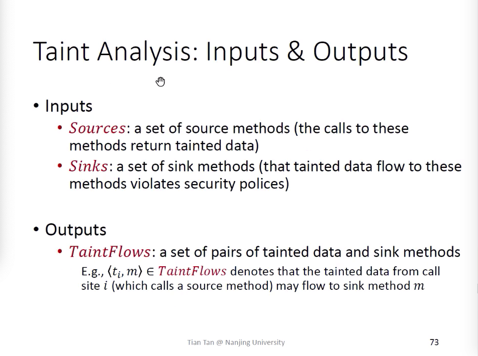

### Taint analysis:rule
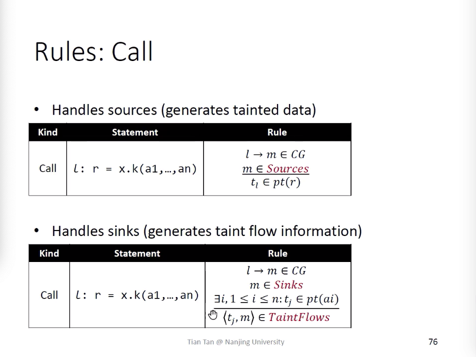
确认sources和sink的两种rule，可以看出对于taint的对象，就是一种特殊的指针传播。
对于一些string的加法，concat的函数。可以直接定义一些污点传播规则，套入指针分析。

##  其他
doop static ananlysis