- [IFDS & CFL](#head1)
	- [Feasible and Realizable Paths](#head2)
	- [ CFL-Reachability](#head3)
	- [Overview of IFDS](#head4)
		- [MOP & MRP](#head5)
		- [ overview](#head6)
	- [Supergraph and Flow Funcations](#head7)
		- [ supergraph](#head8)
		- [flow functions](#head9)
	- [Exploded Supergraph and Tabulation Algorithm](#head10)
		- [exploded supegraph](#head11)
		- [0 -> 0](#head12)
		- [exploded supegraph example](#head13)
		- [tabulation algorithm](#head14)
	- [Understanding the Distributivity of IFDS](#head15)
		- [Can we do constant propagation using IFDS](#head16)
		- [Can we do pointer analysis useing IFDS](#head17)
	- [ 待解决问题](#head18)
# IFDS & CFL

## Feasible and Realizable Paths
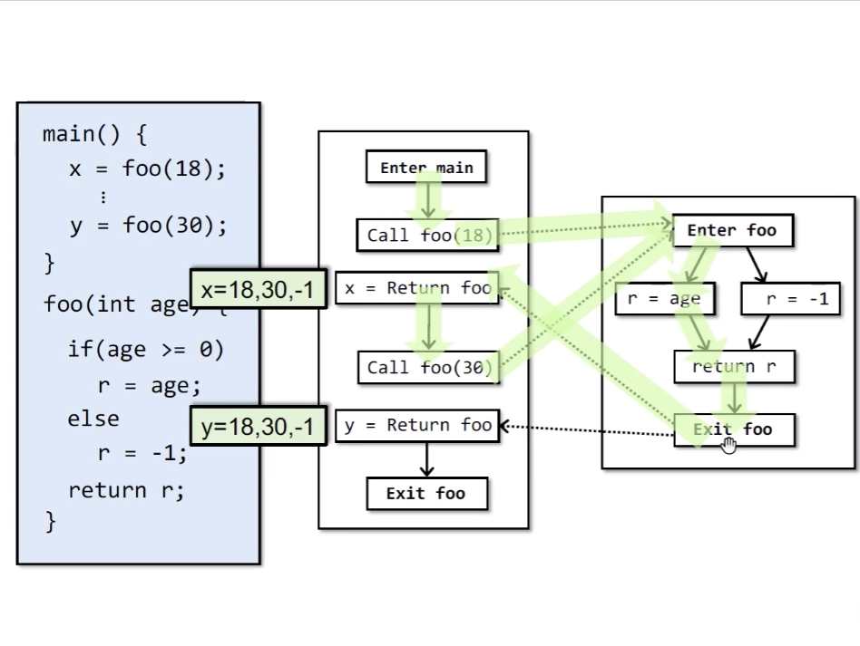
Infeasible Path : Paths in CFG that do not correspond to actual executions.
比如上图中Call foo(30)对应的Return 到 Call foo(18)处。（非上下问敏感）

##  CFL-Reachability
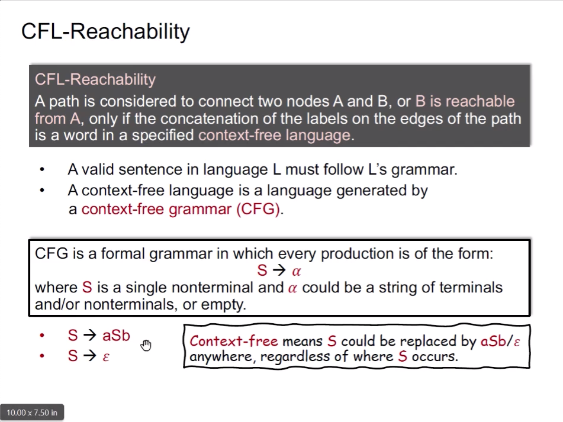
通过 context-free language来描述可执行的路径。
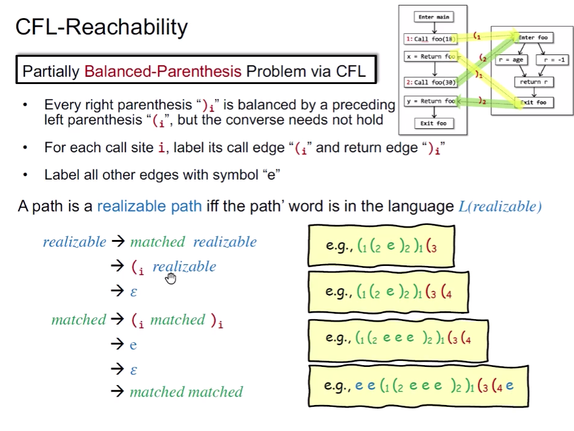
通过（i、)i，表示调用以及返回，来描述调用和返回，)i必须有（i对应，组成合法的label。感觉这个就是（i、)i，描述调用关系，其实也类似于一种上下文。

## Overview of IFDS
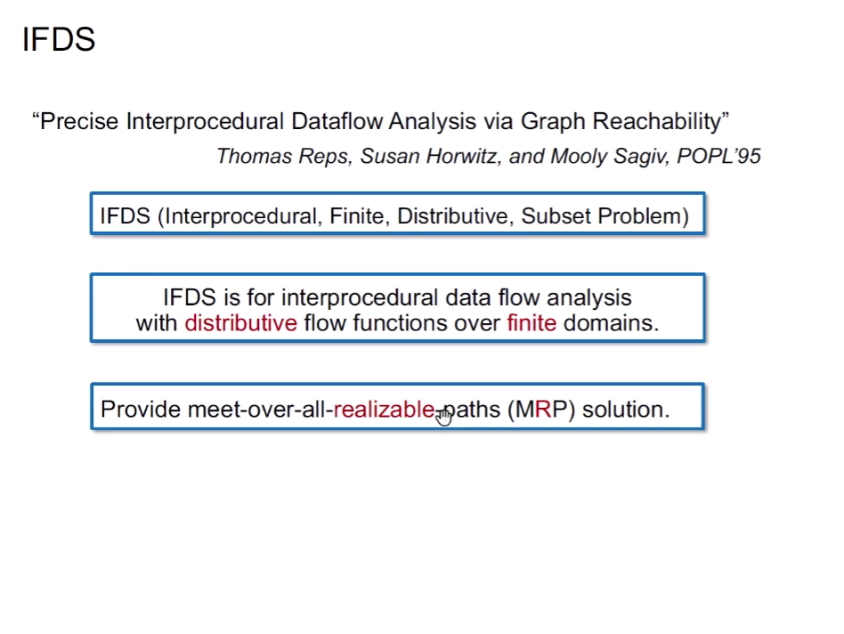
- 过程间
- 域有限
- 可分配
- 子集问题
### MOP & MRP
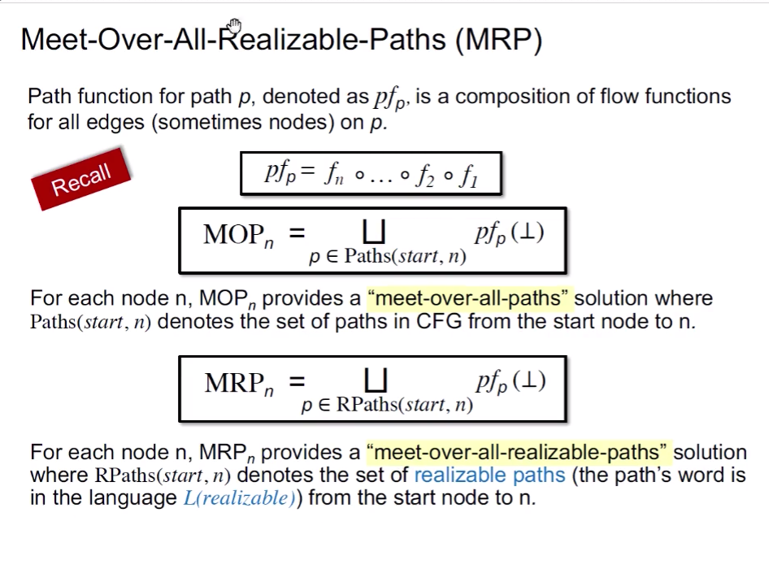
相对于 MOP，MRP是realizable-path
###  overview
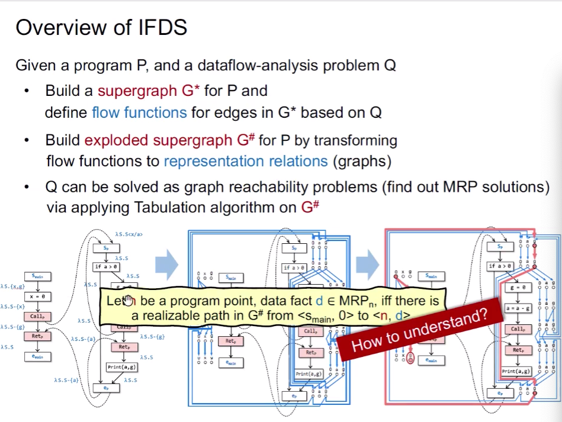
program P，problem Q -> supergraph G* -> exploded supergraph G# -> reachability problems 

## Supergraph and Flow Funcations

###  supergraph
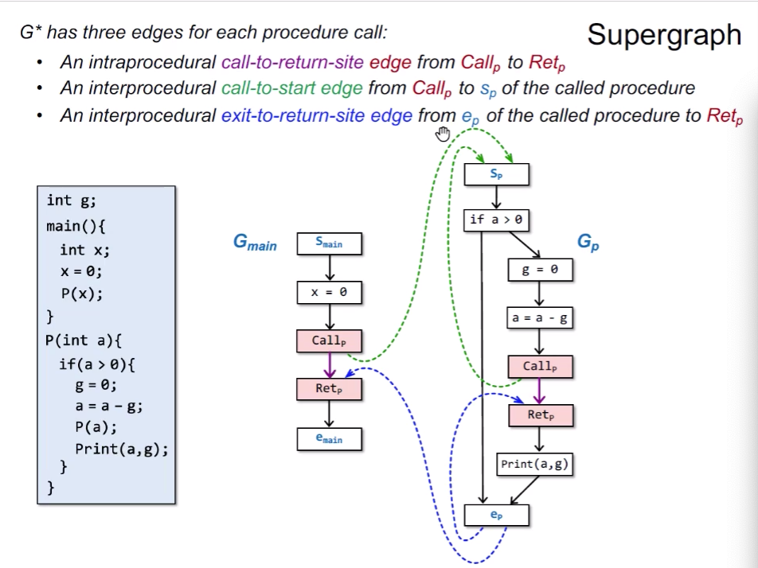

### flow functions
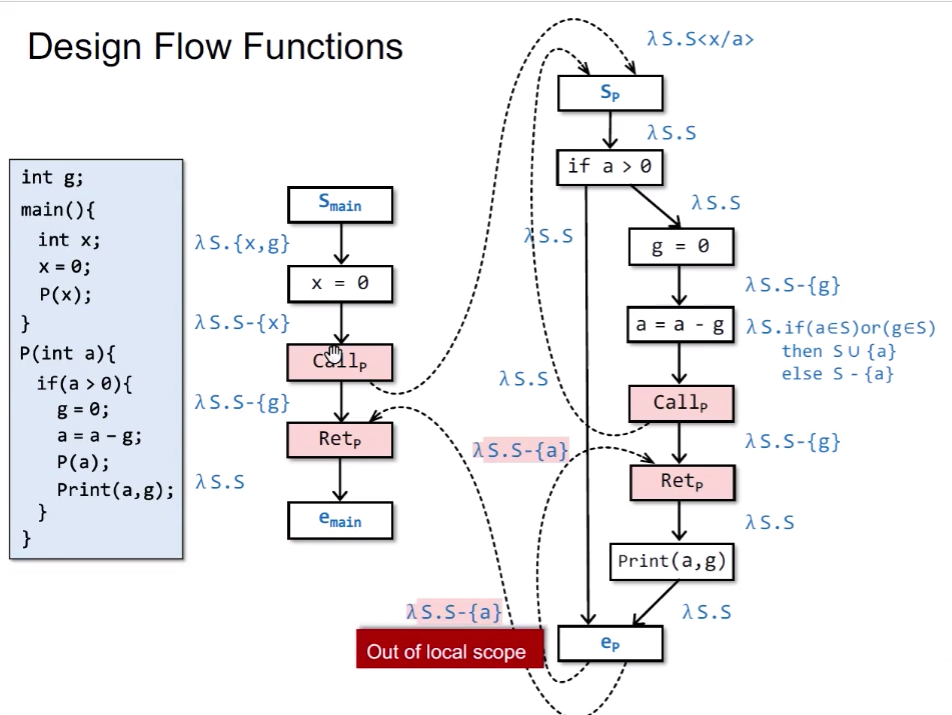
- main函数中的，Callp -> Retp，为什么需要 lambda S.S-{g} ? 因为g是全局变量，会跟随p的调用，进入p，并在Retp处返回。如果不去掉，在Retp处，会导致误报。
- 一开始，我理解Sp的调用为引用传递，然后我考虑函数p的参数x/a，需要在Callp -> Retp处去掉x。该处为值传递，所以不需要去掉。所以java这处只考虑值传递，是因为java只有值传递吗？
- a = a - g 中，transfer func 是 lambda S.if (a∈S) or (g ∈ S) than S  ∪ {a} else S - {a}，其实从从这个函数可以看出，是distribute的，我只需要a或g中的一个fact，即可决定输出。

## Exploded Supergraph and Tabulation Algorithm

### exploded supegraph
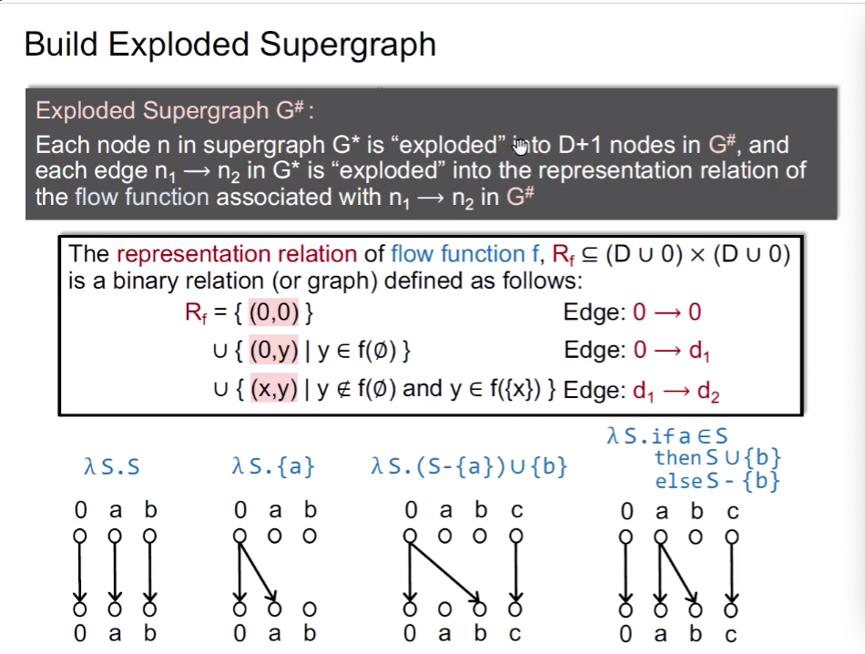

### 0 -> 0
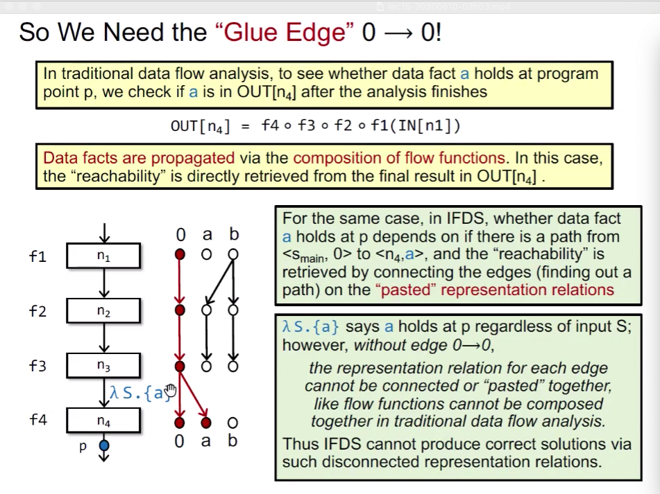

### exploded supegraph example
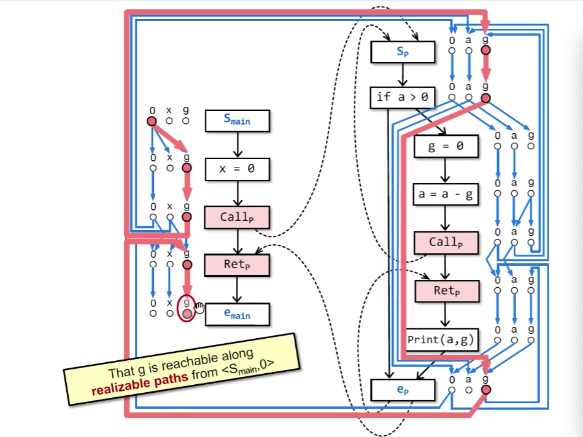

### tabulation algorithm
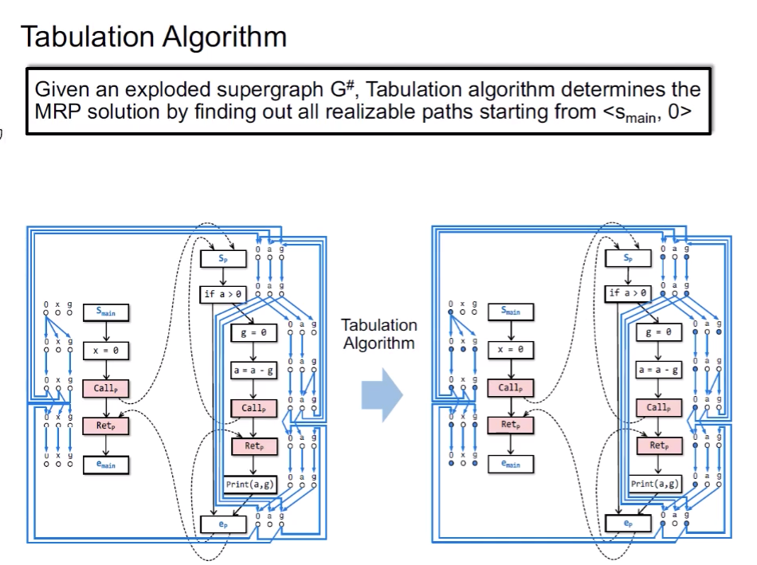
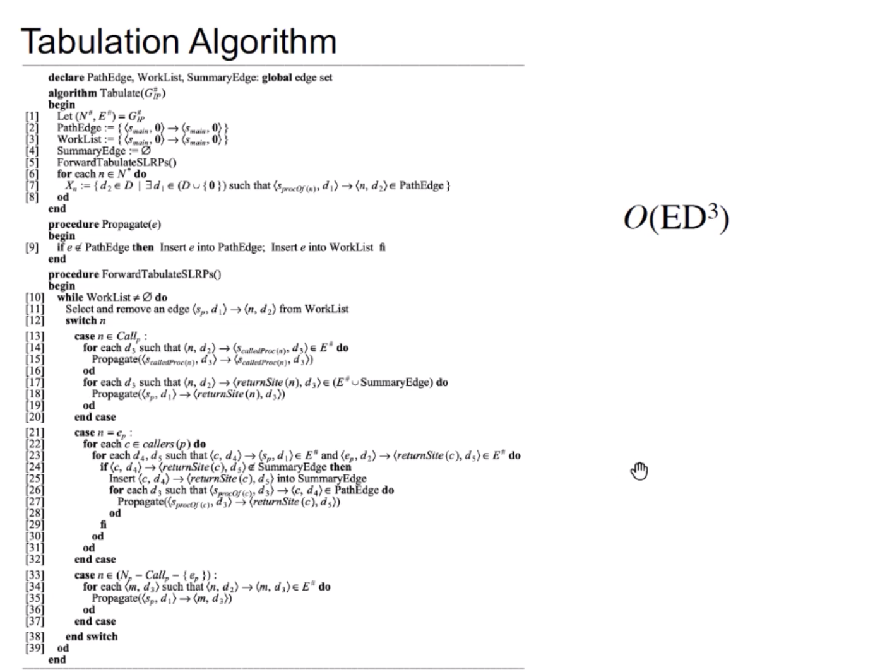

## Understanding the Distributivity of IFDS

### Can we do constant propagation using IFDS

如果我们把constant propagation的域假设为finite，我们仍然不能用IFDS，因为无法解决tranfer func单输入的问题(distribute)。

### Can we do pointer analysis useing IFDS
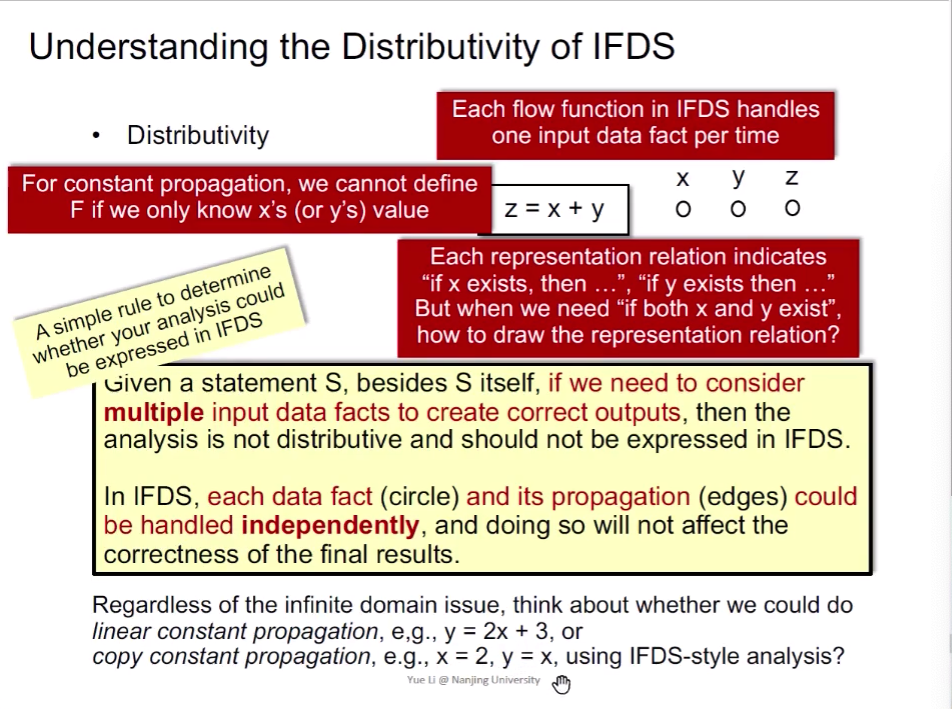
上图求解的问题，是new T 对象，能到达哪些变量。对于上面的传播，缺少alias信息，使结果不sound了，而alias是多输入的函数，所以满足IFDS的distributivtiy。

##  待解决问题
- 找上面实际例子，结合transfer func来理解一下传递的意义，transfer func怎么转换成的representation relations.这些点与点之间的关系的意义
- 对于transfer func转换的规则: f(空集)= {y},为什么y就不能出现在其他的被指向的点上了？
- 仔细研究一下tabulation algorithm细节