- [ Soundiness](#head1)
	- [Soundness and Soundiness](#head2)
		- [ Soundness](#head3)
		- [常见Hardness Feature](#head4)
		- [ 提出Soundiness](#head5)
		- [ Soundness,soundiness,Unsoundness](#head6)
	- [Hard Language Feature : Java Reflection](#head7)
		- [ 反射难论文](#head8)
		- [ 解决反射](#head9)
			- [String Constant analysis](#head10)
			- [ 通过调用处的信息查找](#head11)
			- [Assisted By Dynamic Analysis](#head12)
	- [Hard Language Feature : Native Code](#head13)
		- [Native code 原理](#head14)
		- [ 解决方案](#head15)
#  Soundiness

## Soundness and Soundiness

###  Soundness
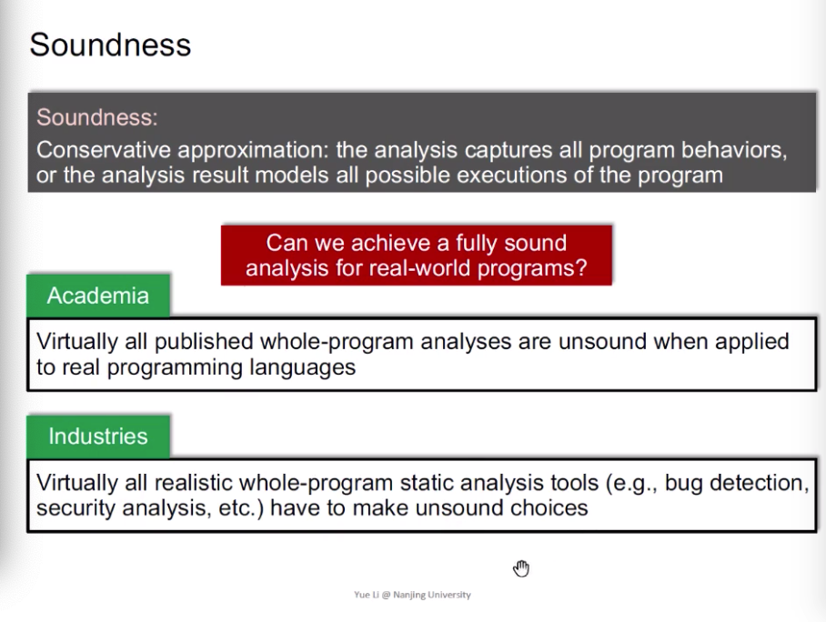
不论学术界、工业界都没有达到一个真正的soundness，因为Hard Language Feature
### 常见Hardness Feature
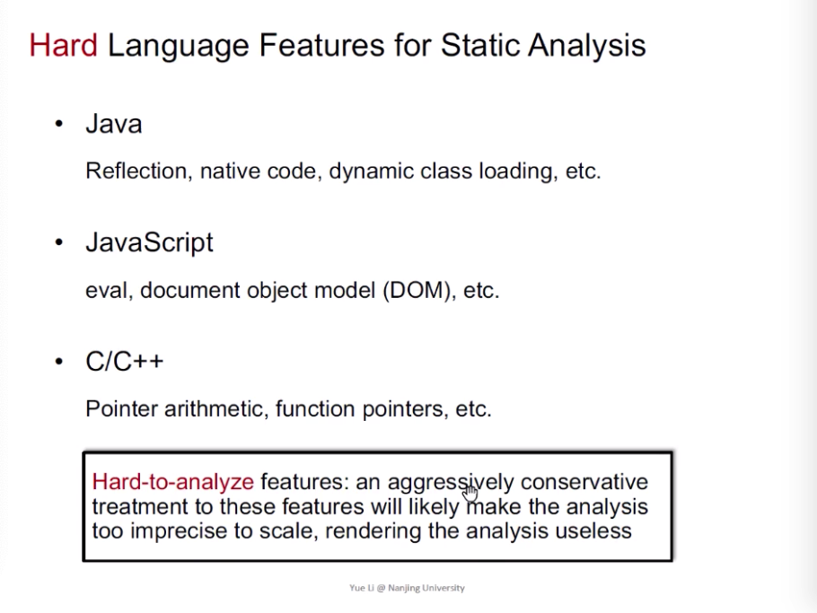

###  提出Soundiness
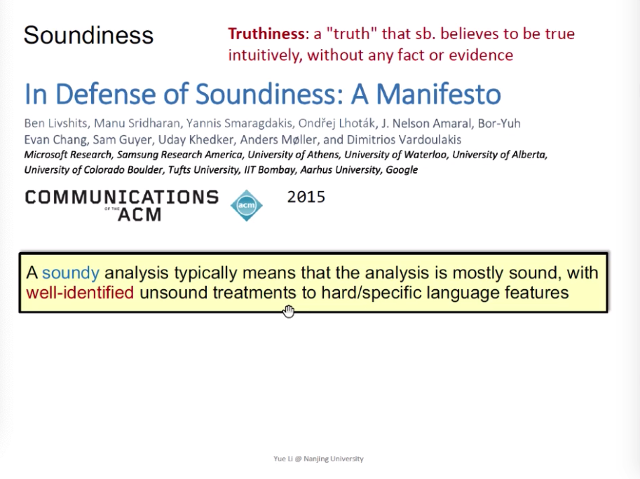

###  Soundness,soundiness,Unsoundness
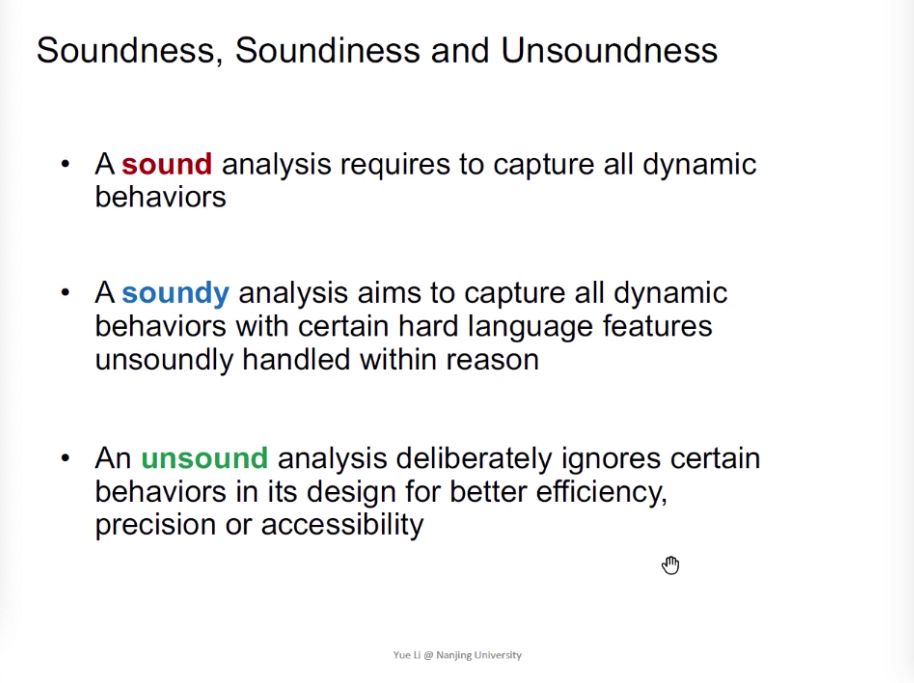

- sound 完全捕获所有的动态行为
- soundy 捕获所有的动态行为，为unsoundly 的处理给予原因或解决策略
- unsound 忽略动态特性

## Hard Language Feature : Java Reflection

###  反射难论文
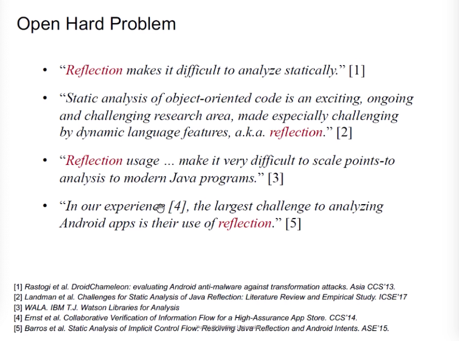
反射存在的意义：Run-time特性，在spring等框架中，用于解耦

###  解决反射
#### String Constant analysis
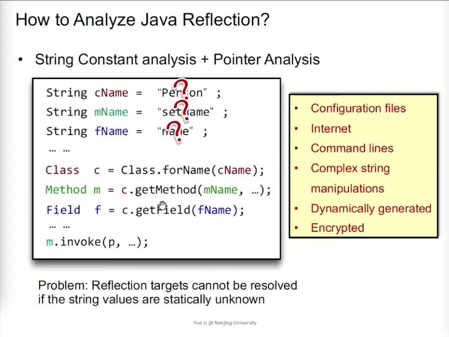
如果存在反射代码中，如果反射中的参数都是字符串，则可以通过字符串，根据程序语义来确定，反射的具体是哪些类、方法、field等。但是实际应用中，这种参数可能存在于任何不可确定的输入中。

####  通过调用处的信息查找
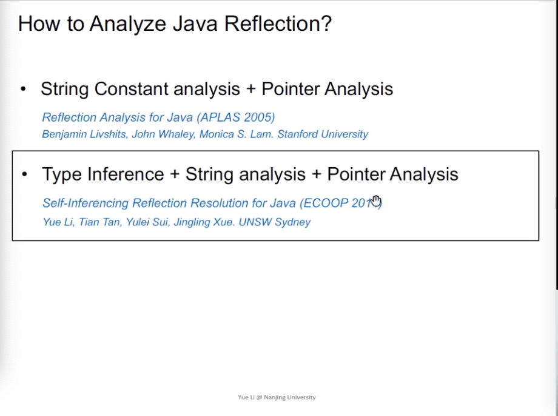
When string arguments cannot be resolved statically, infer the reflective targes at their usage points.
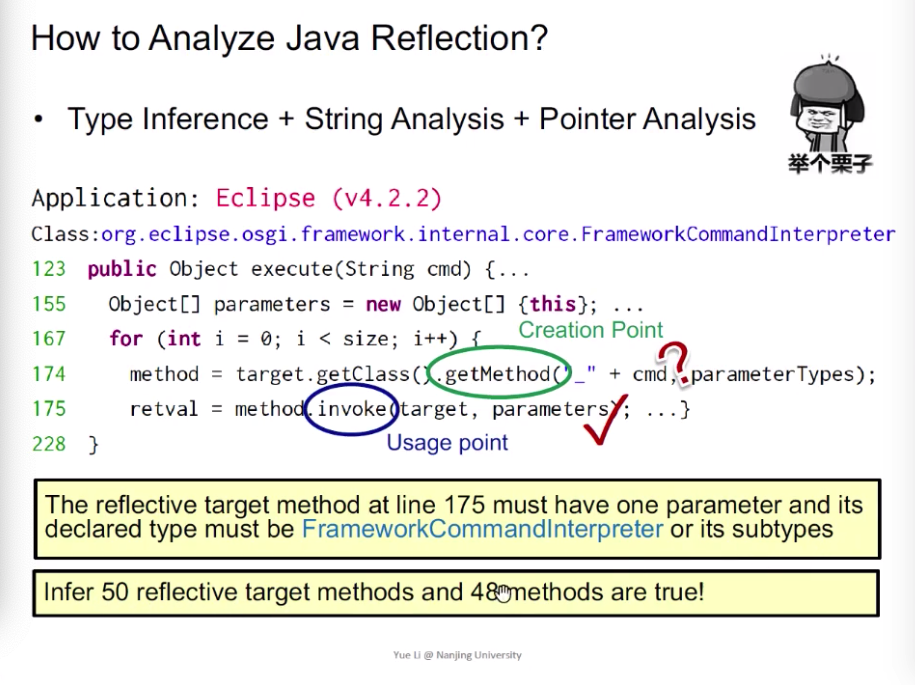
通过parameters参数指针，所指向的所有对象的类型，去推断有这样参数特征的函数

#### Assisted By Dynamic Analysis
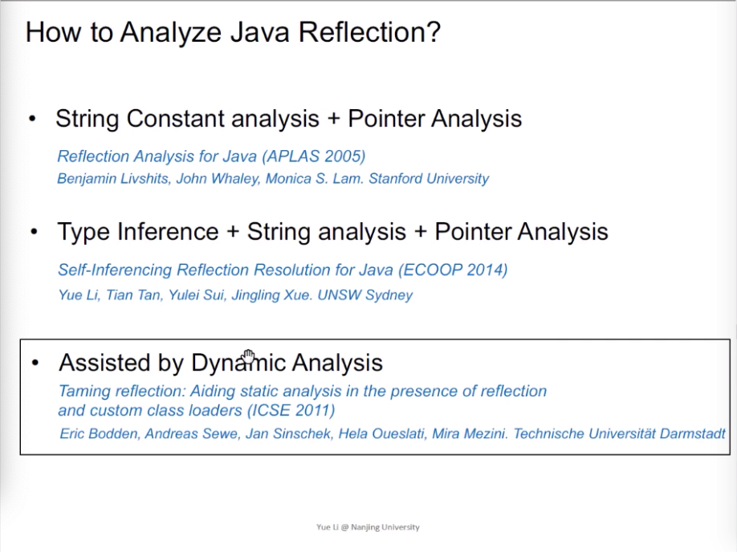
最后一个，通过运行test case，来做到运行中分析。dynamic analysis的缺点：不soundiness，有多少test case，有多少覆盖。

## Hard Language Feature : Native Code

### Native code 原理
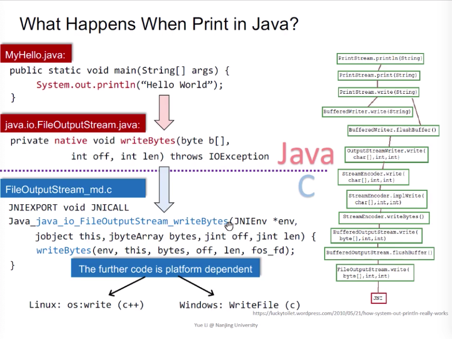
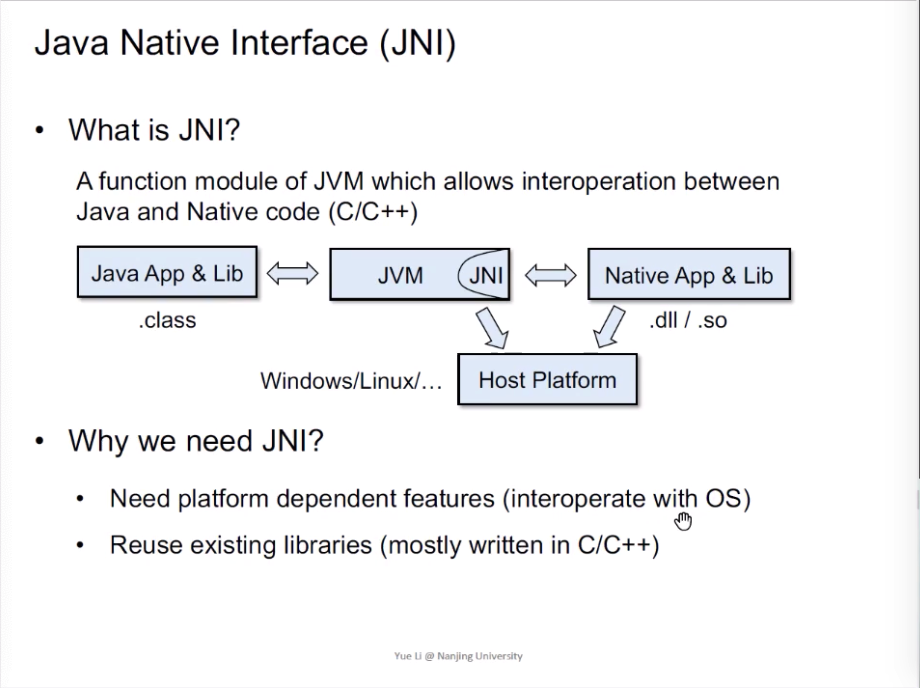
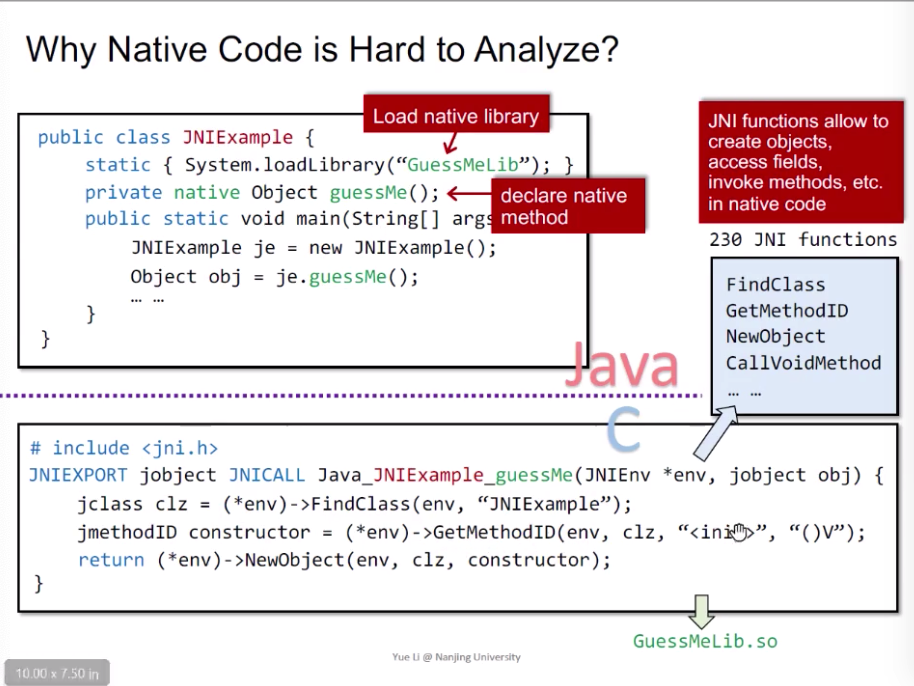
通过java代码调用本地连接库，c可调用Java的一些逻辑。

###  解决方案
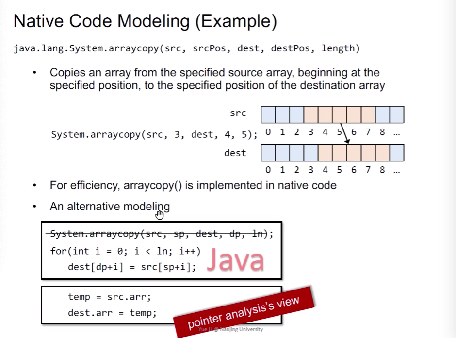
通过java代码实现native功能。