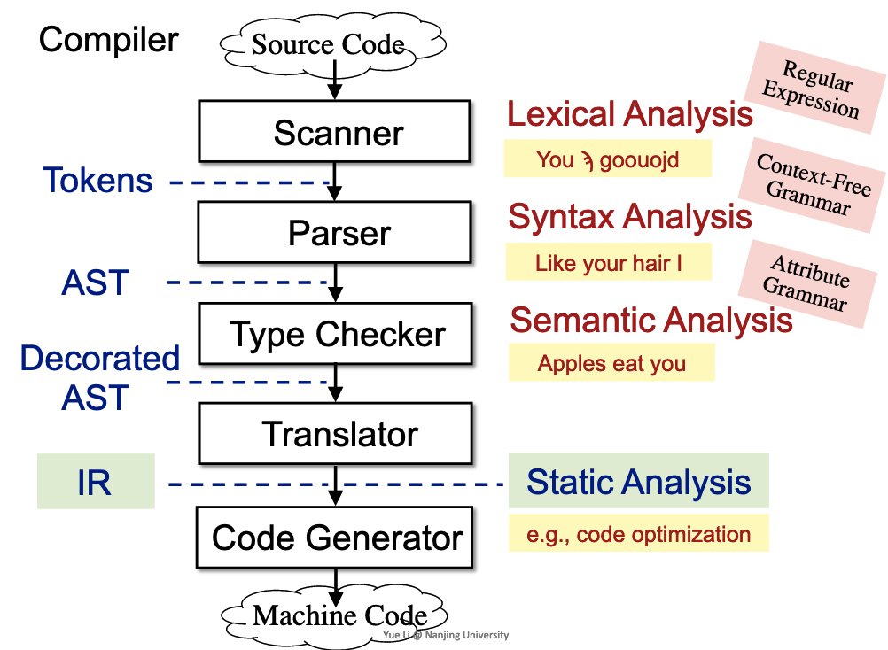
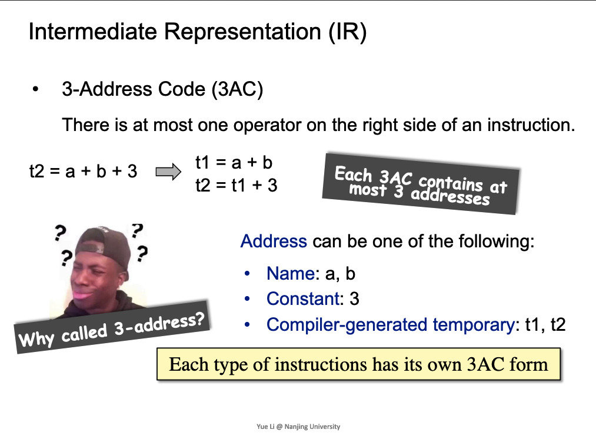
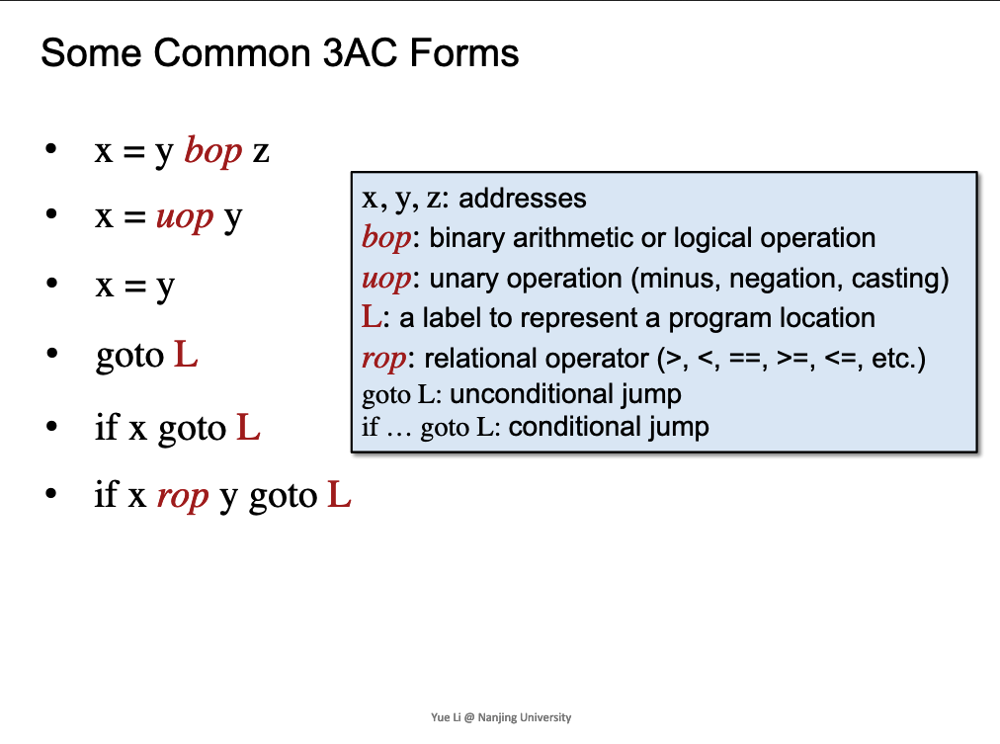
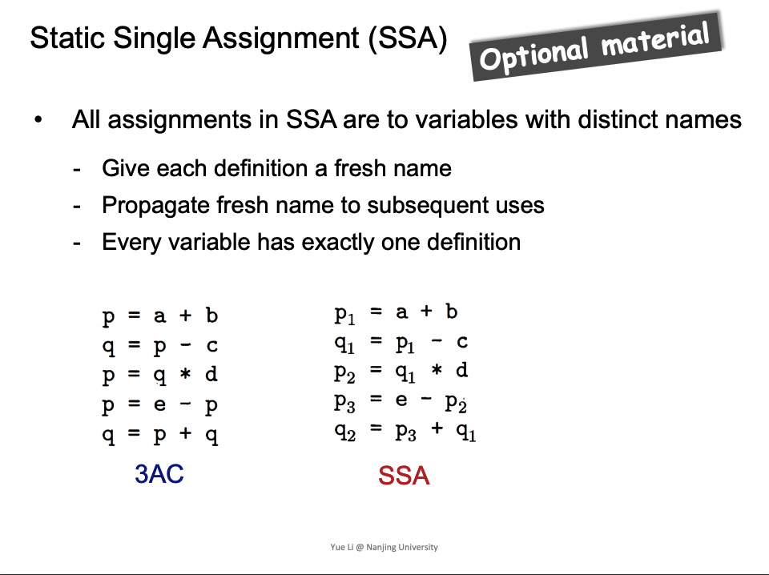
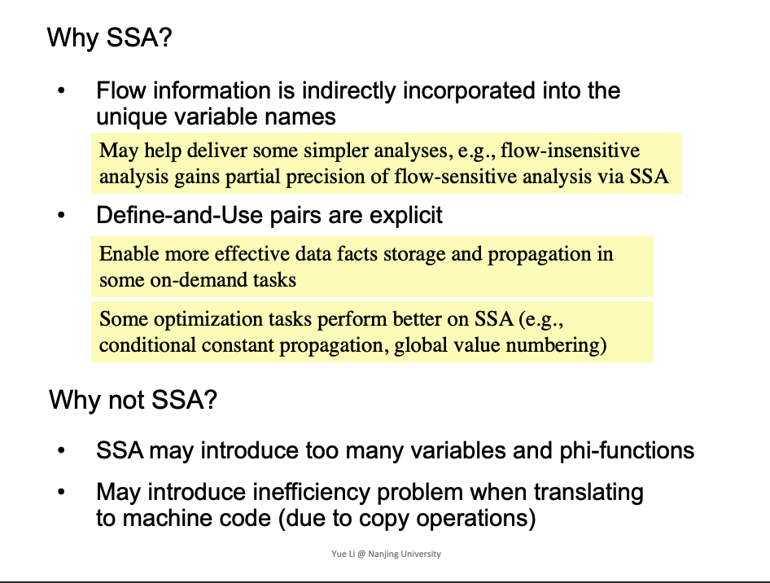
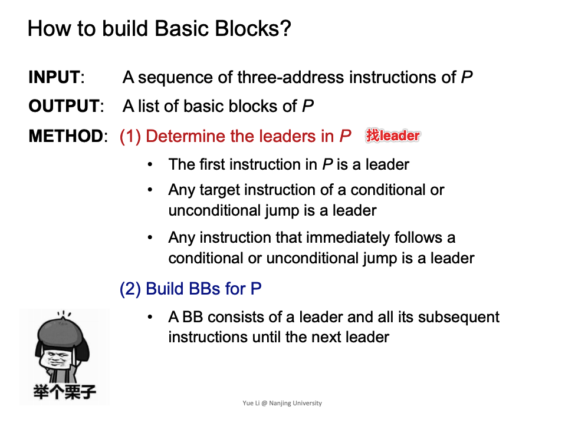
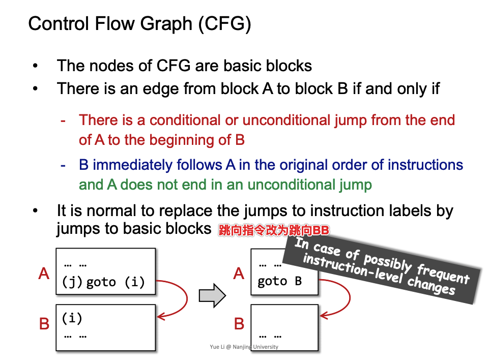

# Intermediate Representation

## Compilers and Static Analyzers



## AST vs. IR


## IR: Three-Address Code (3AC)





## 3AC in Real Static Analyzer : Soot

```
Jvm中的四种调用，在Jvm中invokespecial对应Jimple中specialinvoke
invokespecial:call constructor, call superclass methods, call private methods
invokevirutal:instance methods (virtual dispatch,找真正执行的函数)
invokeinterface: cannot optimization(不做一些优化), checking interface implementation(检查interface的函数是否实现)
invokestatic:call static methods

Java 7:invokedynamic -> Java static typing,dynamic language runs on JVM.

clinit函数，类的静态成员的初始化
```

## Static Single Assignment (SSA)





## Basic Blocks (BB)

BB对于整个指令序列，单指令入口，单指令出口



## Control Flow Graphs (CFG)



再加上函数的Entry和Exit边

BB关系:Successor、predecessor

