- [Data Flow Analysis I](#head1)
	- [Overview of Data Flow Analysis](#head2)
	- [Preliminaries of Data Flow Analysis](#head3)
	- [Reaching Definitions Analysis](#head4)
		- [Reaching Definitions的定义](#head5)
		- [用bit vectors去表示是否可达](#head6)
		- [Transfer function and Control flow](#head7)
		- [ 算法](#head8)
		- [ 栗子](#head9)
		- [ 为什么会最终不变](#head10)
# Data Flow Analysis I

## Overview of Data Flow Analysis
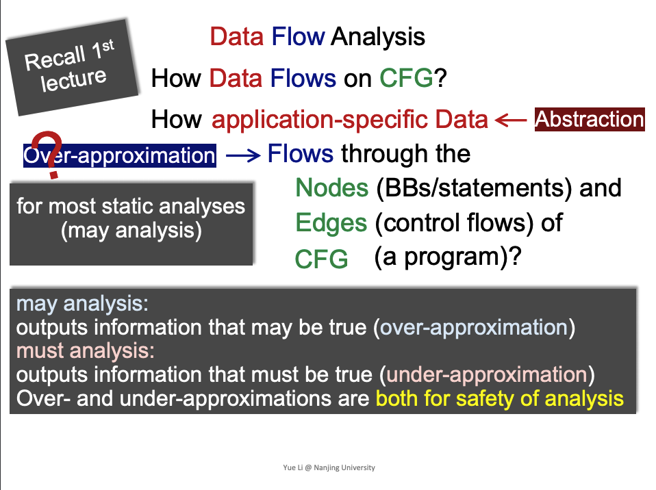
saft-approximation针对不同应用情况分为may analysis 或 must analysis。

## Preliminaries of Data Flow Analysis
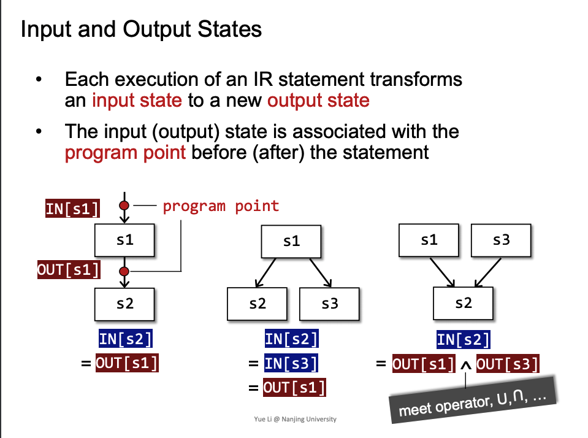

对于merge点进行meet operator，可以是union或intersection等集合操作

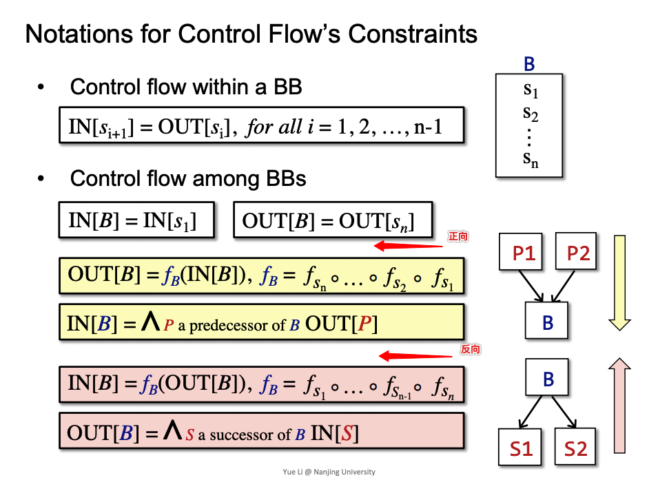

对于数据流分析，可以顺着数据流方向分析，也可以逆向，看具体应用。

## Reaching Definitions Analysis

### Reaching Definitions的定义
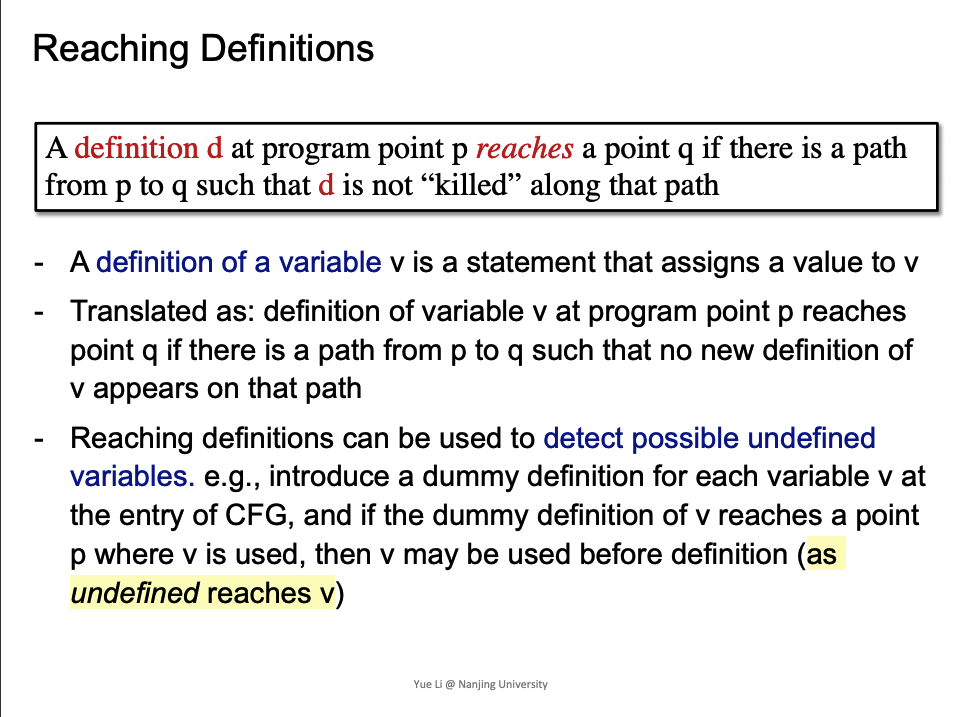

### 用bit vectors去表示是否可达
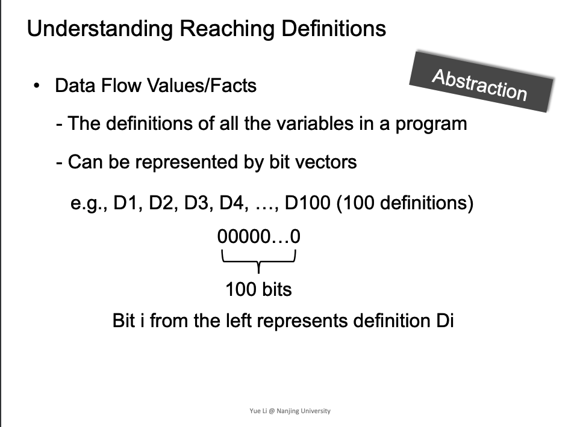

### Transfer function and Control flow
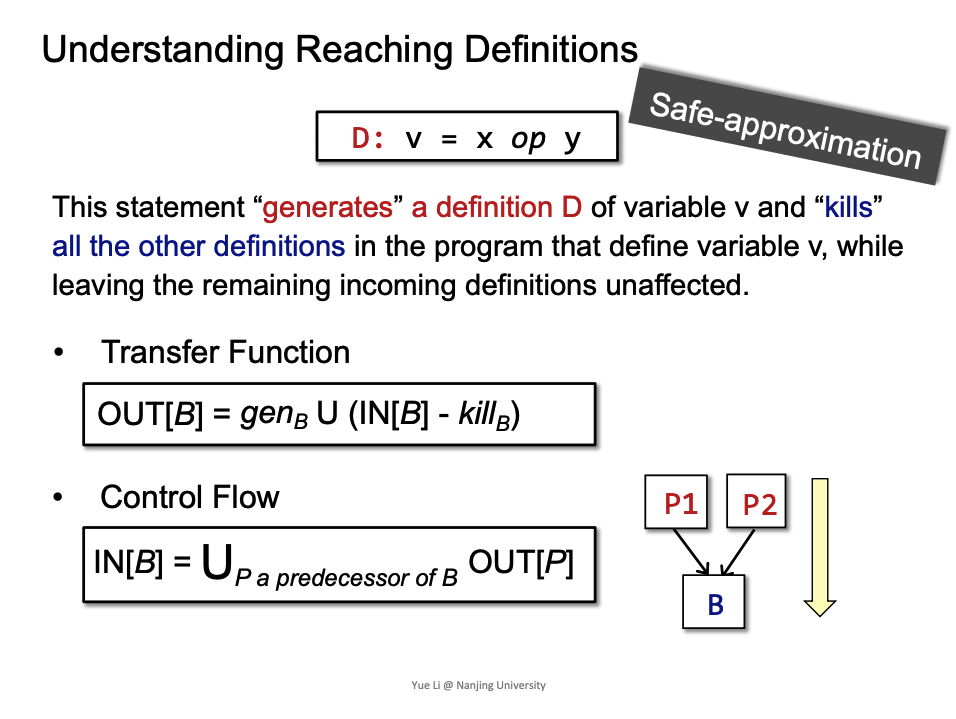

- Transfer function
  - gen ，在这表示生成的Def
  - kill  ，在这表示新的定义
- Control flow
	- 通过union操作，merge操作

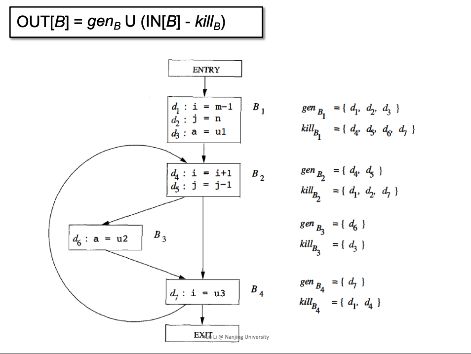

抽象的域是di的集合，是每一个指令是否能到达哪些BB。

我的理解:对于kill，是可以kill掉后面的，这个可以理解为如果后面有一BB能goto当前BB的入口，则kill掉，如果没有，也不会影响。

###  算法

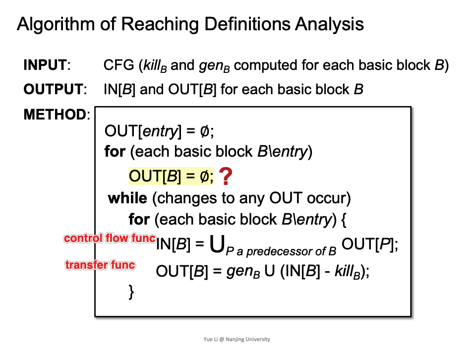

这个迭代算法结构，可以应用到其他的算法中。

###  栗子
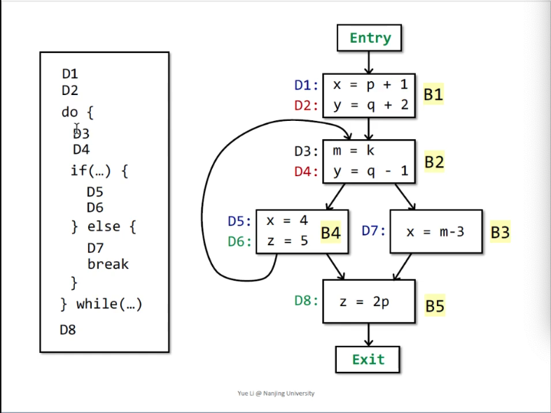

- 我理解，一些细节注意的点
   - 多次迭代，是对于for(each basic block B\entry)
   - 对于每一个bb,gen、kill是固定的
   - 为什么会变，因为(1)为前提，比如在B1->B2的merge，第一次是 0000 U OUT[B1]，而第二次的时候，B4的值不再是初始值，所以会变。进而导致OUT[B2]变化，进而影响后面的BB。但观察对于OUT[B4]后面会稳定到一个值(第二到第三次迭代)，IN[B2]稳定，进而，后续的稳定。
   - 这种遍历方式，与编写程序会有一些理解上的差异，比如while的边，B4->B2的边，我不会再一次遍历中，重新更新B2。而是以下次迭代来表示这个循环。

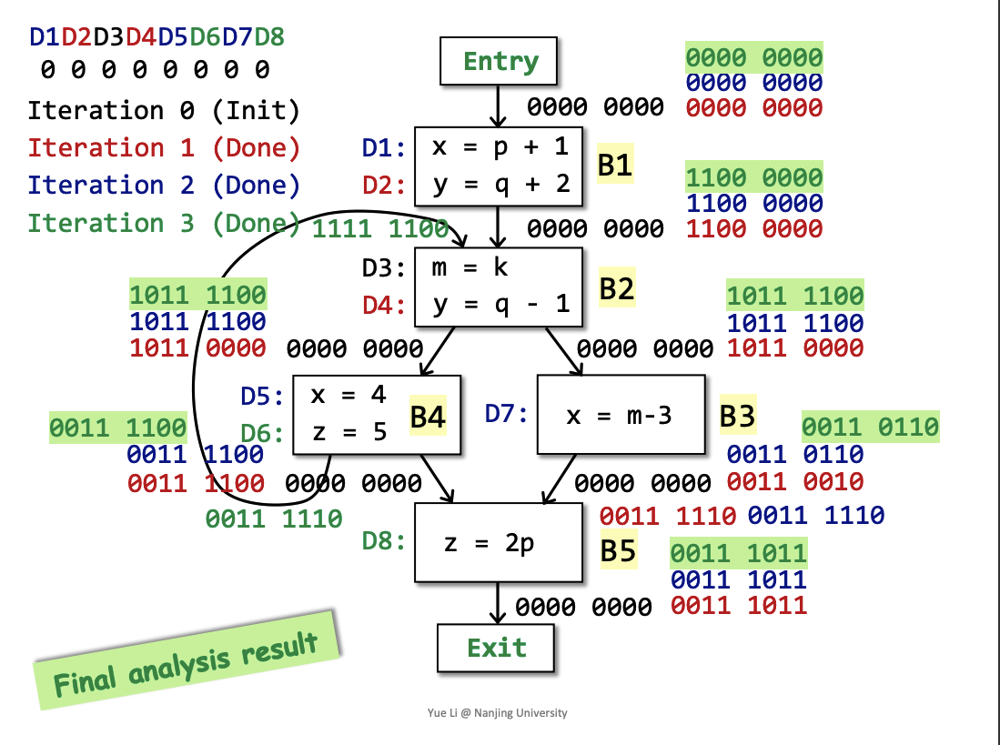

###  为什么会最终不变
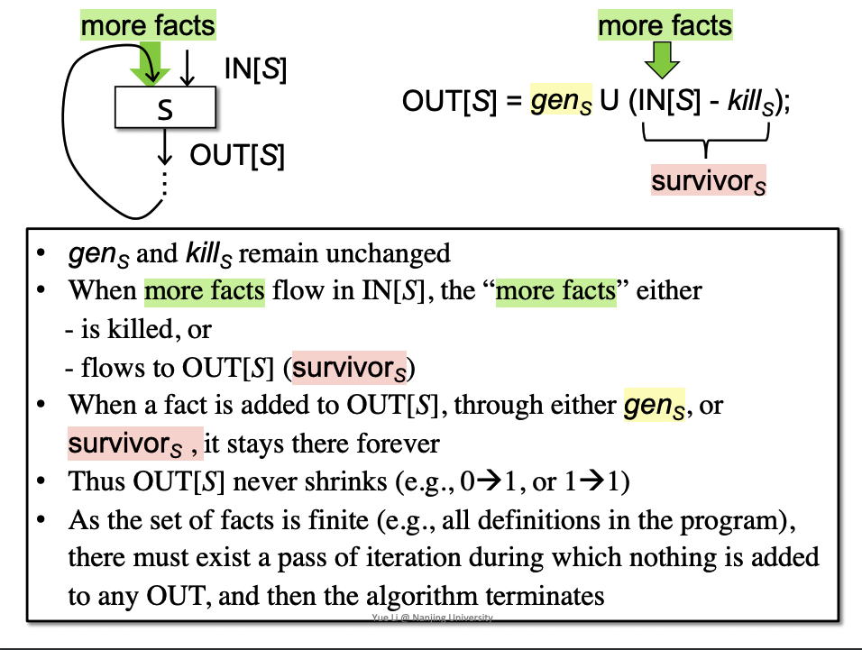
对于一个BB，gen、kill是固定的，当有新facts的进入的分支(之前进来的为初始化vector，经过迭代后进来的新的)，对于OUT[S]的vector中1只增不减，是单调的。

当所以fact经过多次迭代，都到达了IN[S]，则OUT[S]不会变了。
