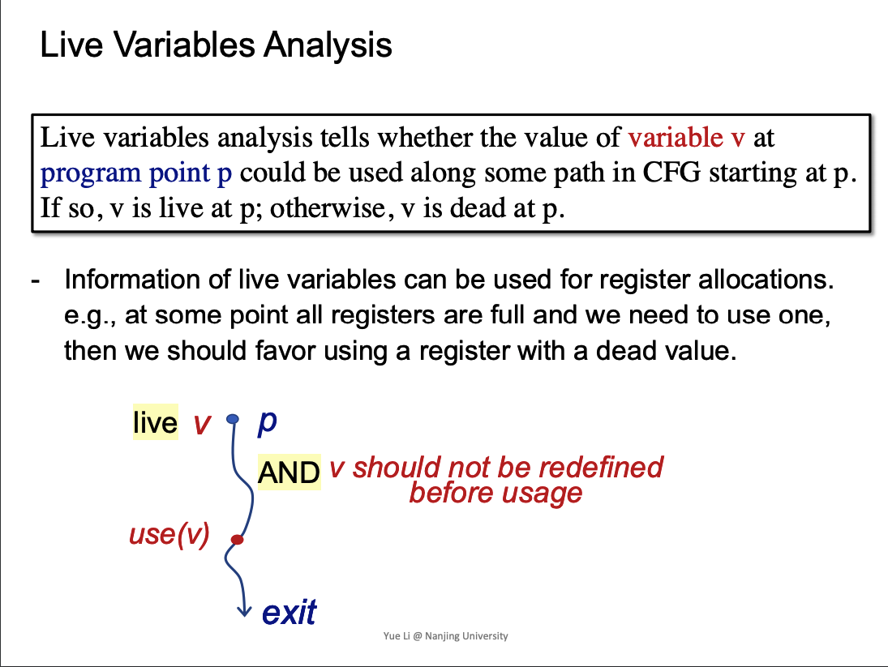
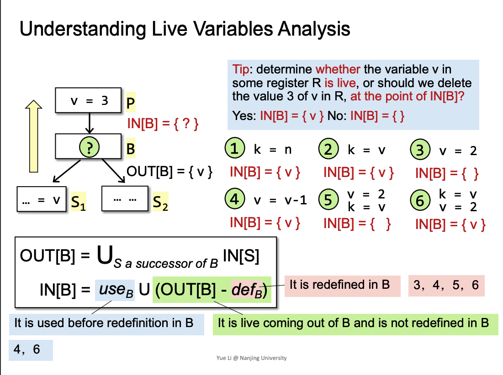
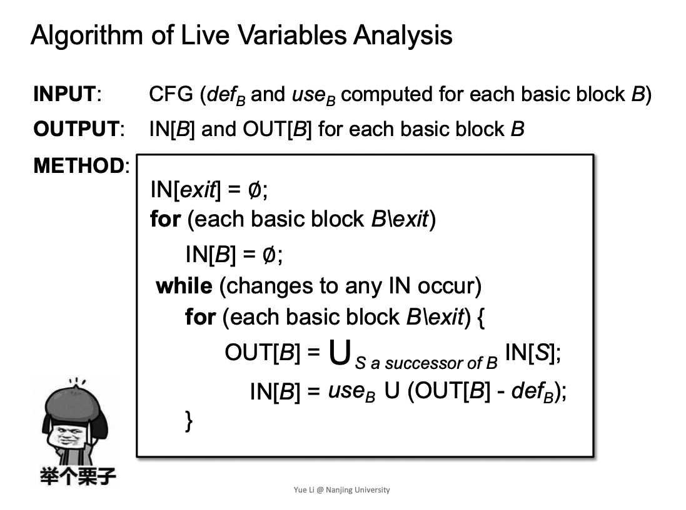
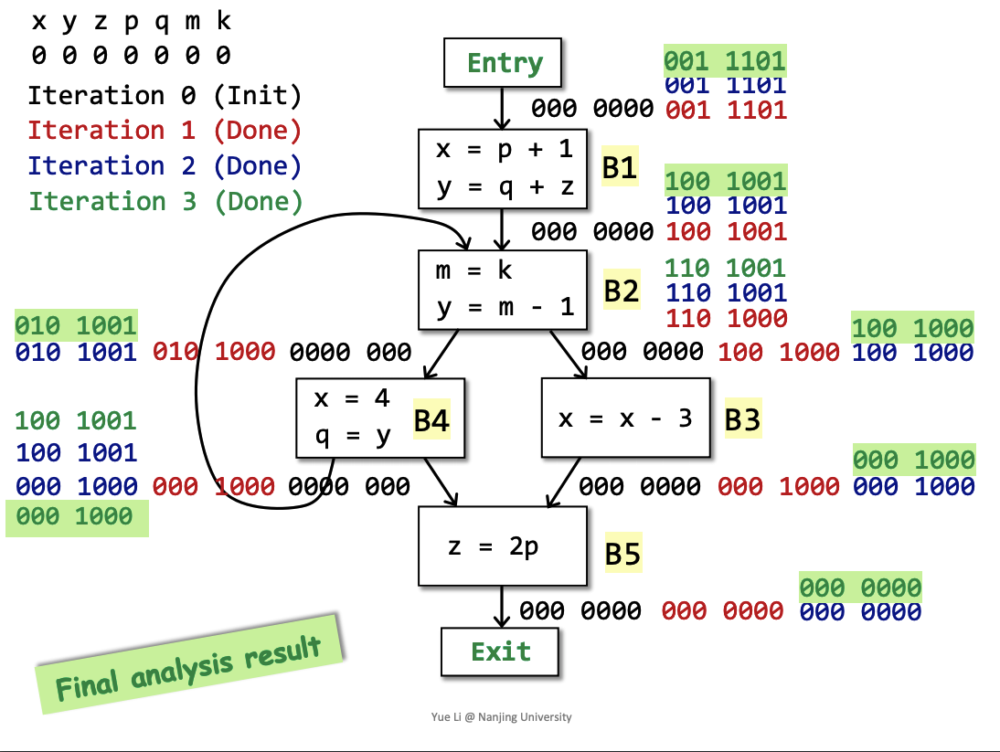
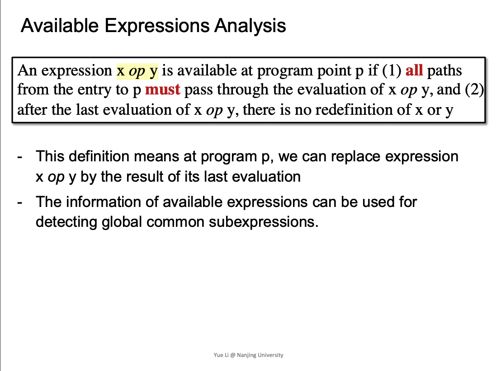
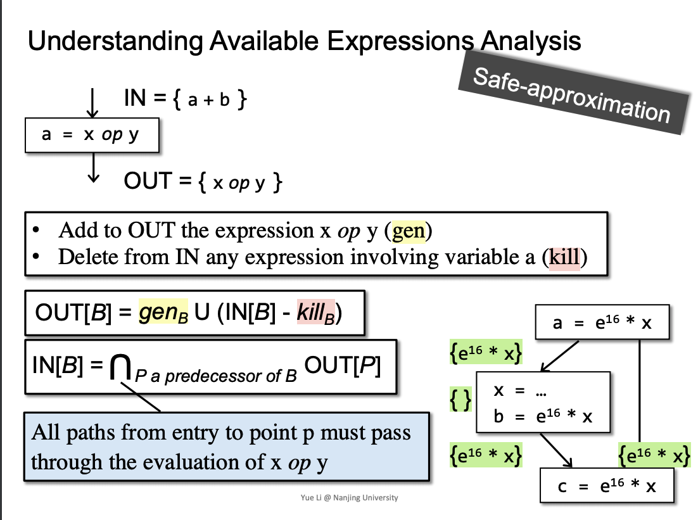

- [Data Flow Analysis II](#head1)
	- [Live Variables Analysis](#head2)
		- [ 定义](#head3)
		- [transfer func and control flow merge](#head4)
		- [ 算法](#head5)
		- [ 栗子](#head6)
	- [Available Expressons Analysis](#head7)
		- [ 定义](#head8)
		- [transfer func and control flow merge](#head9)
		- [ 算法](#head10)
	- [ 三种算法对比](#head11)
# Data Flow Analysis II

## Live Variables Analysis
###  定义

应用:determine whether the variable v in some register R is live.

### transfer func and control flow merge

###  算法

我的一些思考:
- 为什么初始化是 for(each basic block B\exit) {IN[B]=Φ}
  - 逆向求解，对于一个BB，merge是用后继的IN，求OUT[BB]。然后通过Transfer(OUT[BB]) = IN[BB]，所以我们需要的是所有BB的IN，才能获取前驱的OUT，所以初始化的是IN[B] = Φ。
- 对于一个BB，正向与逆向merge位置的区别
  - 逆向，对于当前这个BB，merge后续Si的merge(IN[Si]...)，所以后续的输入不同，求解的当前BB的IN[BB]都是相同的。与正向相反，当前BB，输入需要merge，输出相同。所以哪些位置merge，要考虑求解方向。

###  栗子

## Available Expressons Analysis
###  定义

### transfer func and control flow merge

注意右下角这种，对于avaliable expression的需求来说，虽然x被重新赋值，但是在c = ..这点，仍然满足需求，可以用之前该expression，用于该点。

###  算法

must analyse的特点

- for(each basic block B\entry) {OUT[B] = U}，初始化为U，全部
- merge 操作是intersection

从需求上理解，对于当前BB，该expression可用，必须保证所有IN[BB]，都可用，才能达到safe-approximation，所以是intersection

##  三种算法对比
