- [Data Flow Analysis - Foundations I](#head1)
	- [Iterative Algorithm, Another View](#head2)
	- [Partial Order](#head3)
		- [ 偏序](#head4)
	- [Upper and Lower Bounds](#head5)
		- [ 定义](#head6)
		- [ poset性质](#head7)
	- [Lattice, Semilattce,Complete and Product Lattice](#head8)
		- [ Lattice](#head9)
		- [Complete Lattice](#head10)
		- [Product Lattice](#head11)
	- [Data Flow Analysis Framework Via Lattic](#head12)
	- [Monotonicity and Fixed Point Theorem](#head13)
		- [ 定义](#head14)
		- [证明-Existence of fixed point](#head15)
		- [证明-The fixed point is the least](#head16)
		- [lattice 上数学运算与data analyse ](#head17)

# Data Flow Analysis - Foundations I

## Iterative Algorithm, Another View

k-tuple抽象成每次迭代的输入输出

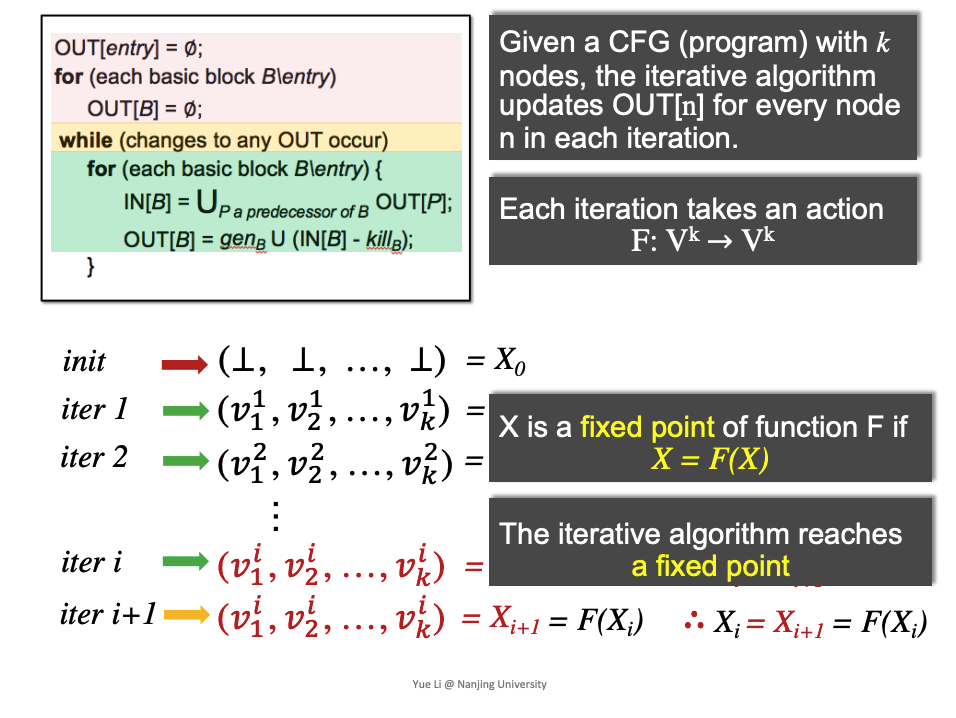

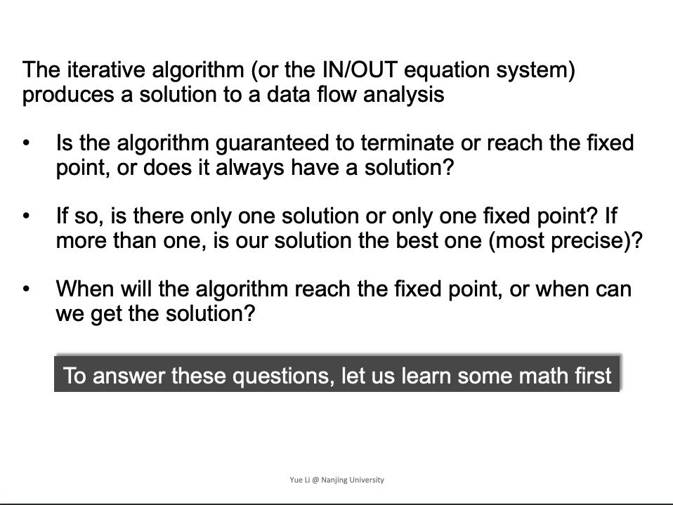

三个问题:
- 算法迭代是否能停止，是否能有一个解
- 如果是，是否是唯一解，唯一不动点，是否是最好的
- 算法什么时候到达不动点，什么时候我们能得到一个解

## Partial Order

###  偏序
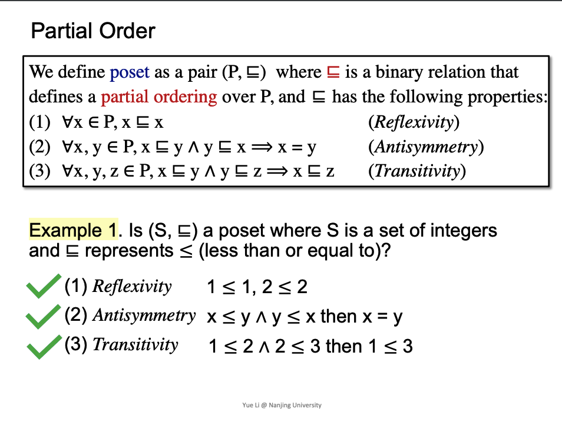

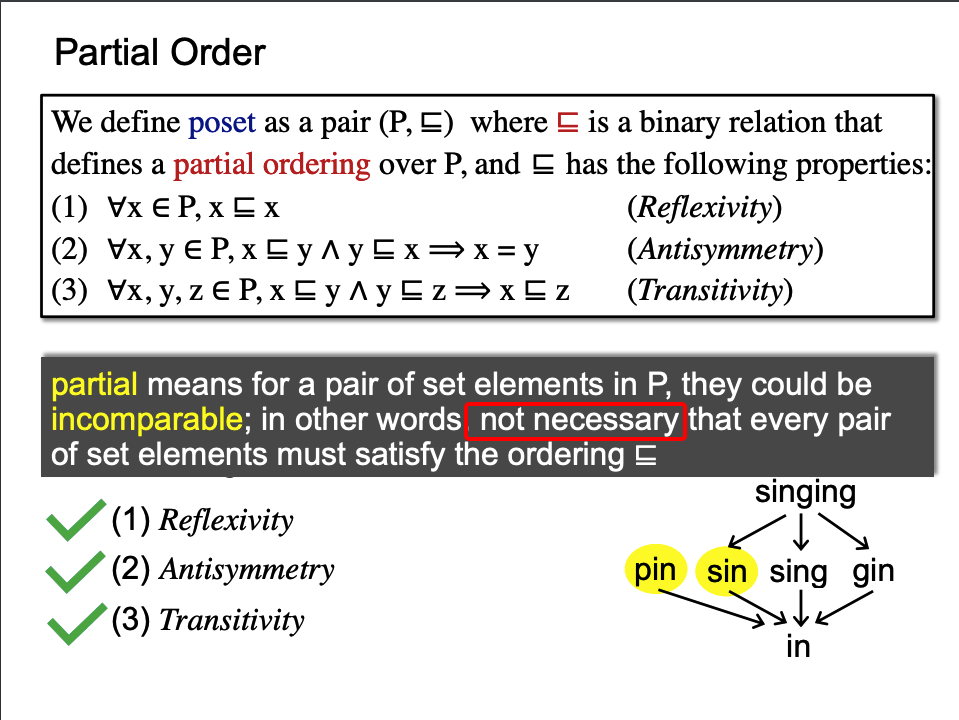

偏序关系意义，在集合中的任意一部分不一定需要满足偏序关系，如pin,sin之间并没有偏序关系

## Upper and Lower Bounds

###  定义

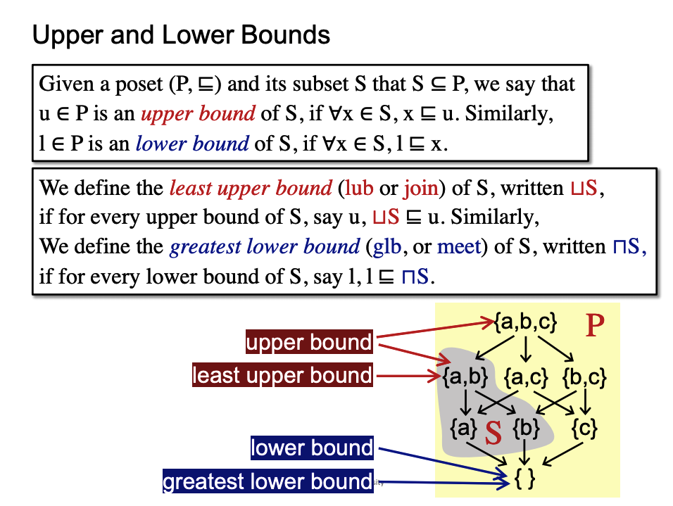

upper bound不一定是subset S中，也可能是P中的。

###  poset性质

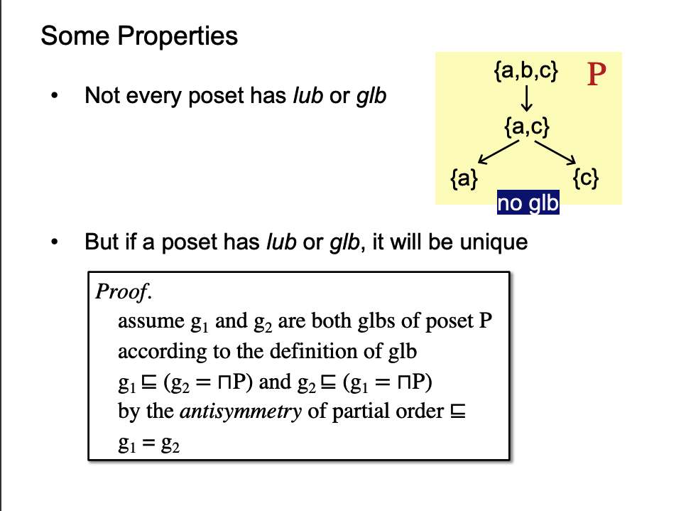

## Lattice, Semilattce,Complete and Product Lattice
###  Lattice
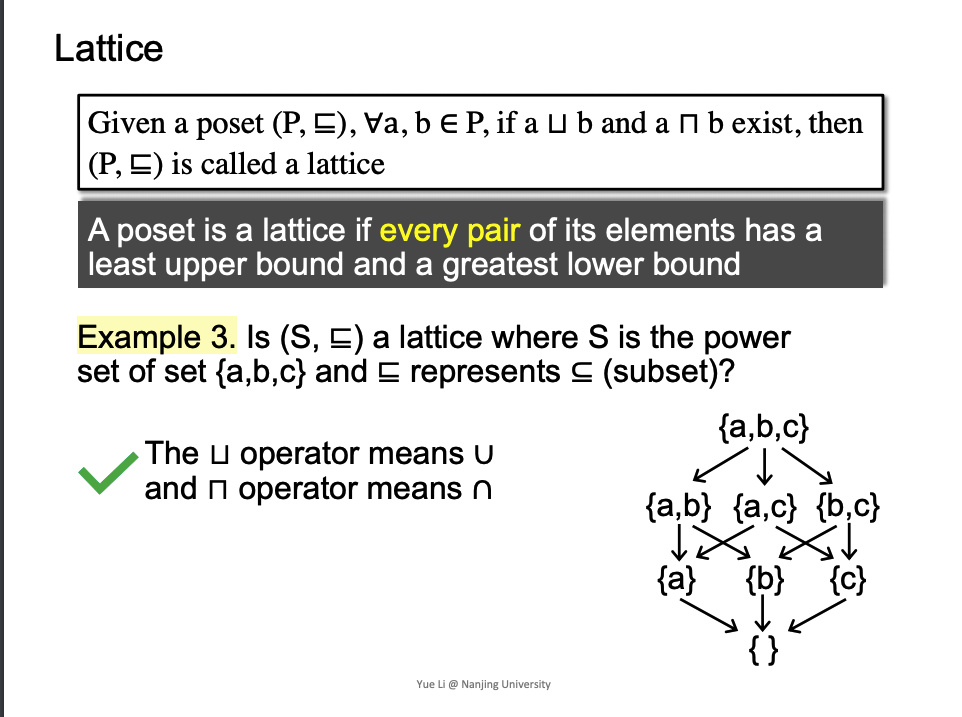

拓展:半格

 - 对于只有join存在, ∪ ，join semilattice
 - 对于只有meet存在,∩ ， meet semilattice

### Complete Lattice
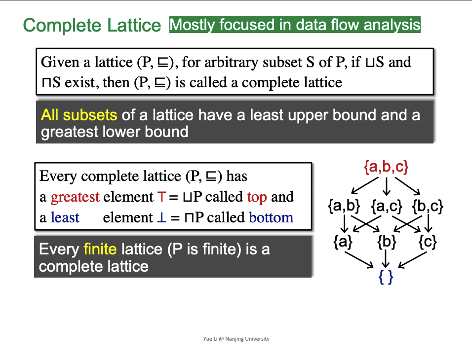

- lattice 是任意两个元素，complate lattice是任意subset

- complete lattice 不一定是finite lattice，比如0-1的之间的实数，存在bound，但是不是finite

### Product Lattice

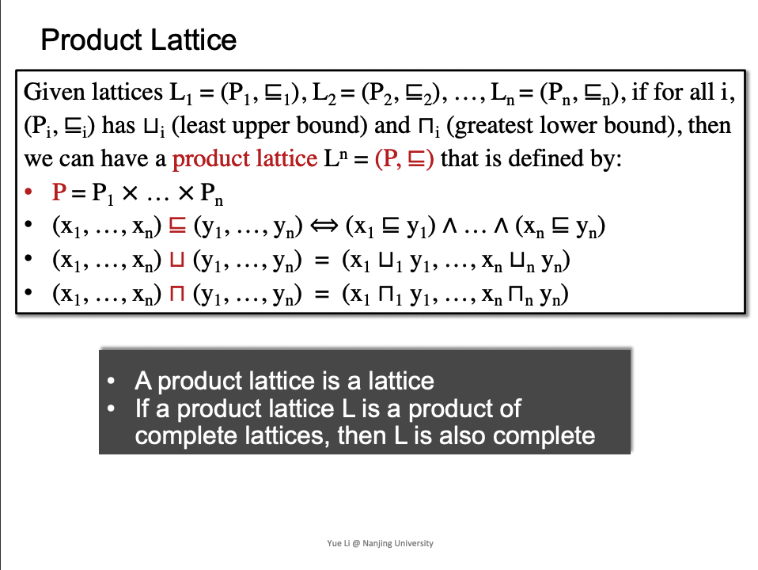

对应迭代算法里的k-tuple

## Data Flow Analysis Framework Via Lattic

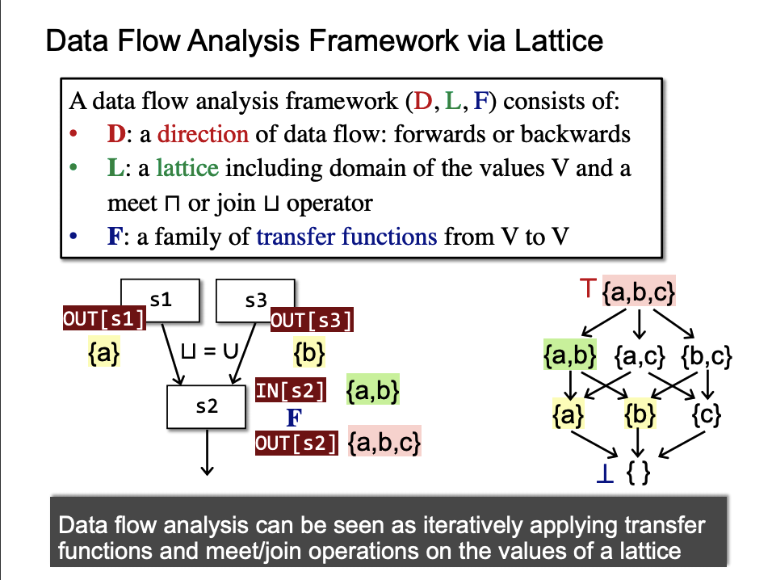

## Monotonicity and Fixed Point Theorem

###  定义

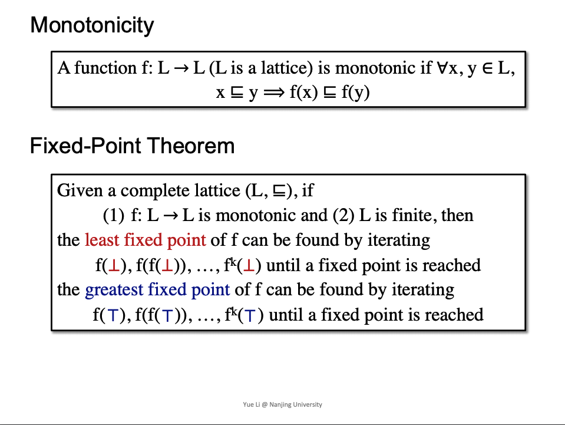

### 证明-Existence of fixed point

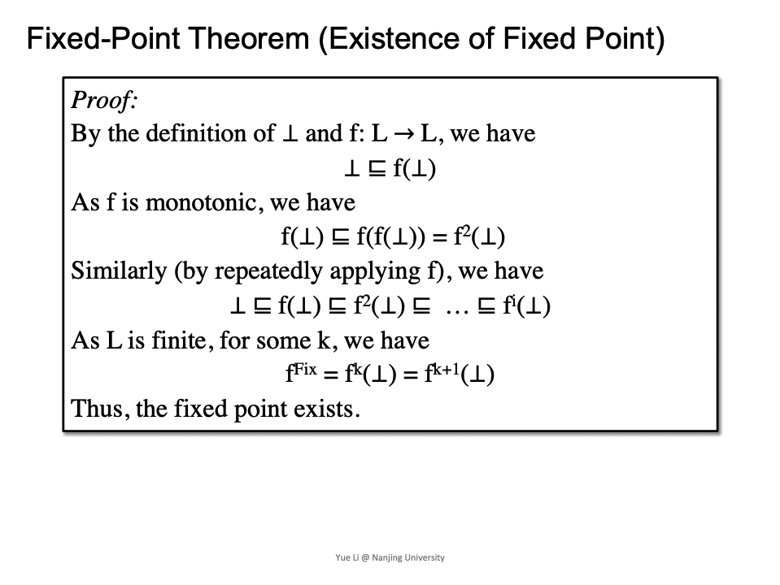

因为是product lattice，所以有last upper bound或greatest lower bound，所以当单调递增到f(last upper bound)时，就会达到fix point。

### 证明-The fixed point is the least
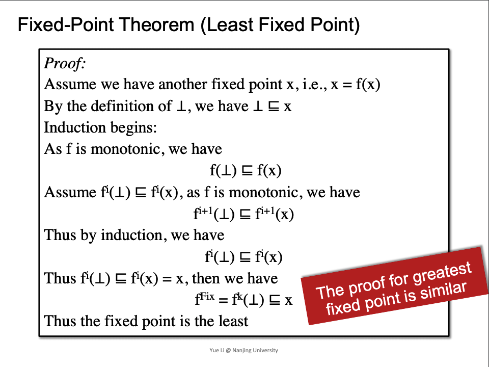

### lattice 上数学运算与data analyse 
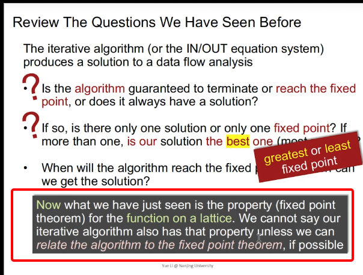