- [Interprocedural Analysis](#head1)
	- [ Motivation](#head2)
		- [Call Graph](#head3)
	- [Call Graph Construction(CHA)](#head4)
		- [Call Graph算法对比](#head5)
		- [ Dispatch](#head6)
			- [Java中的method invoke](#head7)
			- [method signature](#head8)
			- [virtual call dispatch](#head9)
		- [ CHA](#head10)
			- [ 定义](#head11)
			- [ Resolve](#head12)
			- [ 全程序算法](#head13)
	- [Interprocedural Control-Flow Graph](#head14)
		- [ 定义](#head15)
	- [Interprocedural Data-Flow Analysis](#head16)
		- [ 过程间分析组成](#head17)
		- [Interprocedural Constant Propagation](#head18)
			- [ 组成](#head19)
			- [ 栗子](#head20)
# Interprocedural Analysis

##  Motivation

### Call Graph

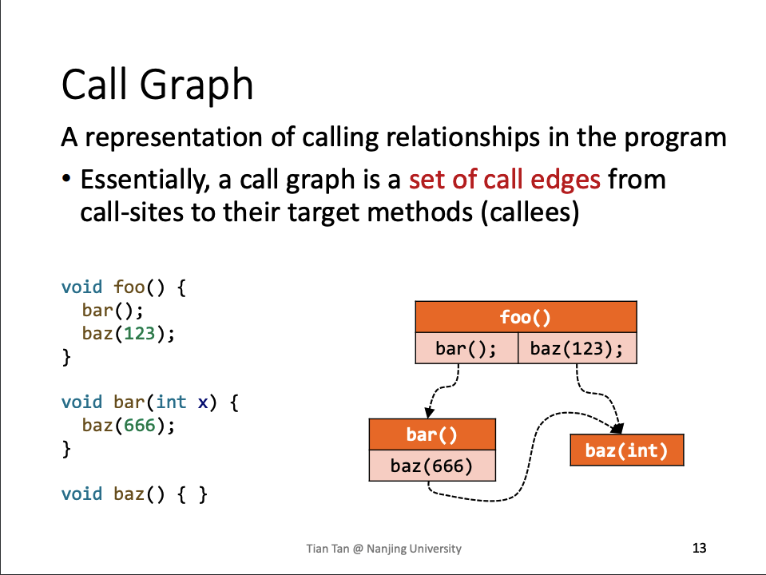

为了表达过程间分析，我们需要call graph

## Call Graph Construction(CHA)

### Call Graph算法对比

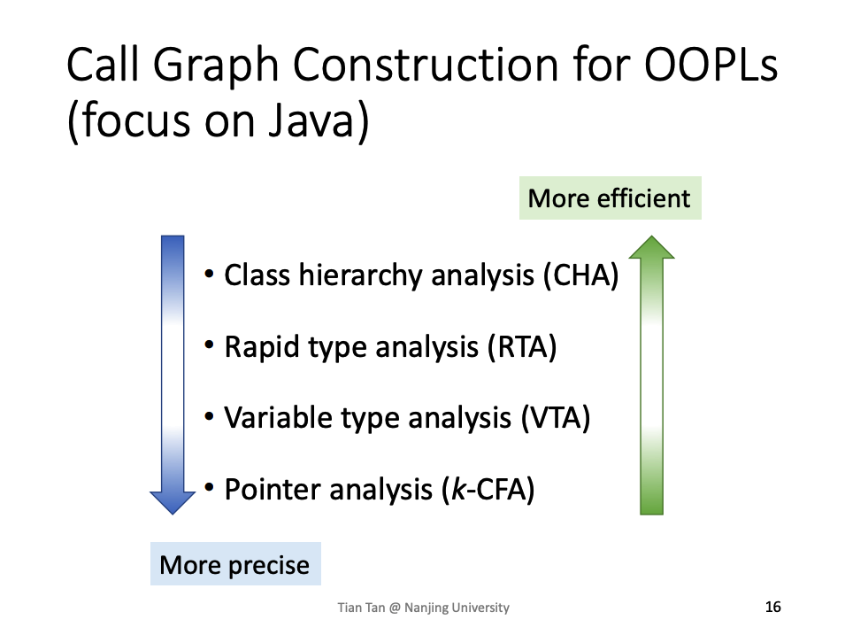
###  Dispatch

#### Java中的method invoke
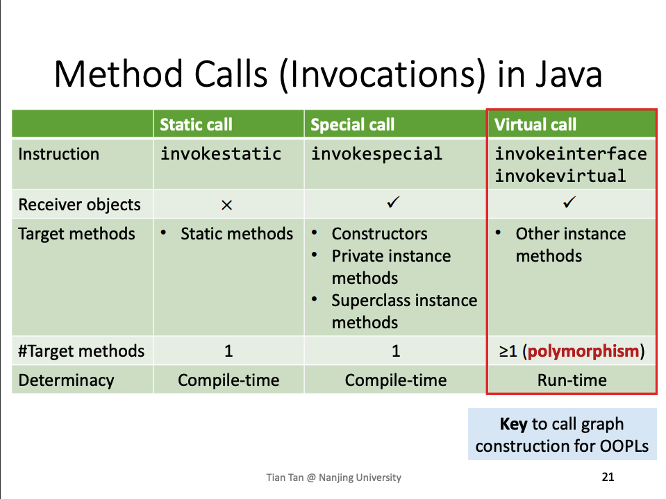
#### method signature
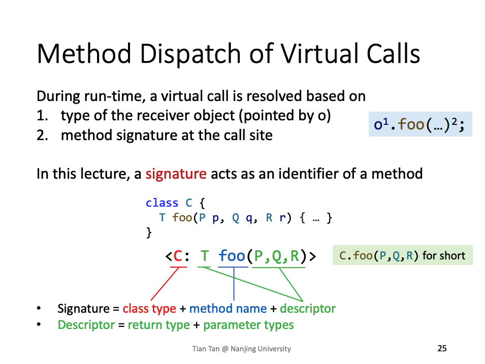
#### virtual call dispatch
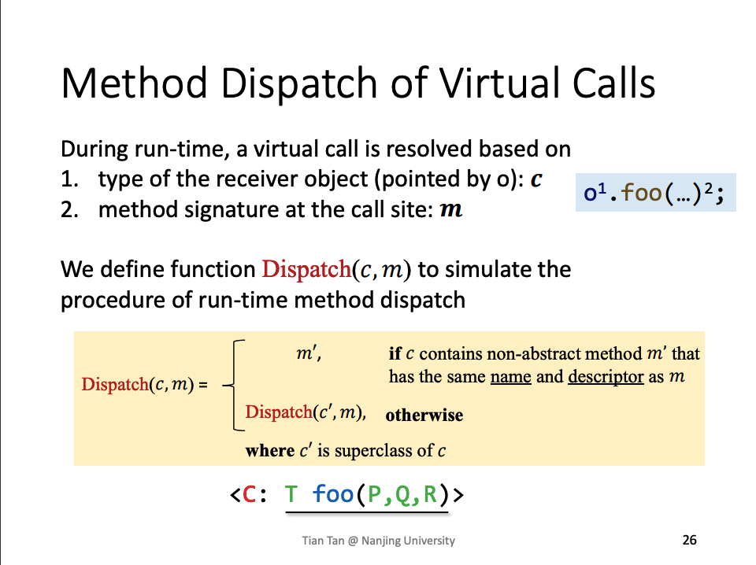

###  CHA

####  定义
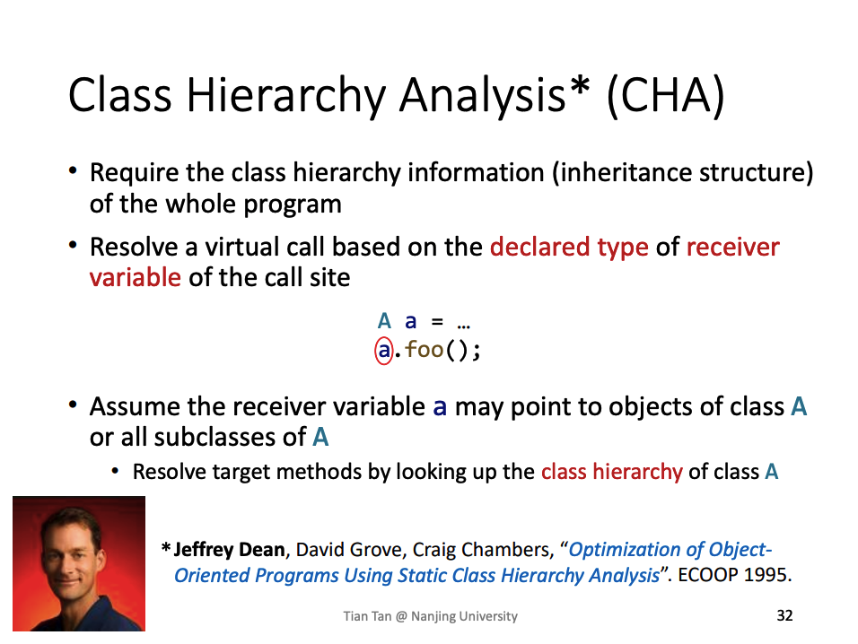
####  Resolve
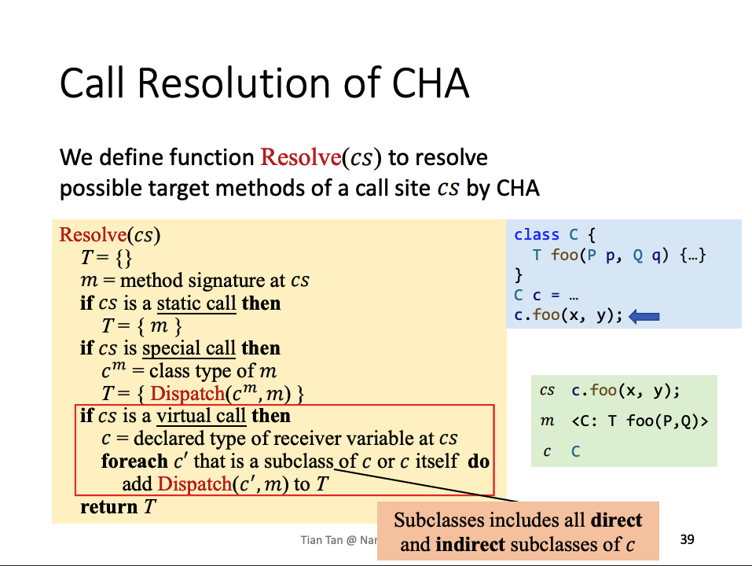

问题:
- 对于special call，private instance method和constructor直接找到当前类的调用, superclass instance method 直接可以通过dispatch 当前类父。不太清楚为什么constructor是直接在当前类中调用的，应该是涉及到java构造函数的底层原理。

- 对于virtual call是dispatch当前receiver类型及其后代类。

####  全程序算法
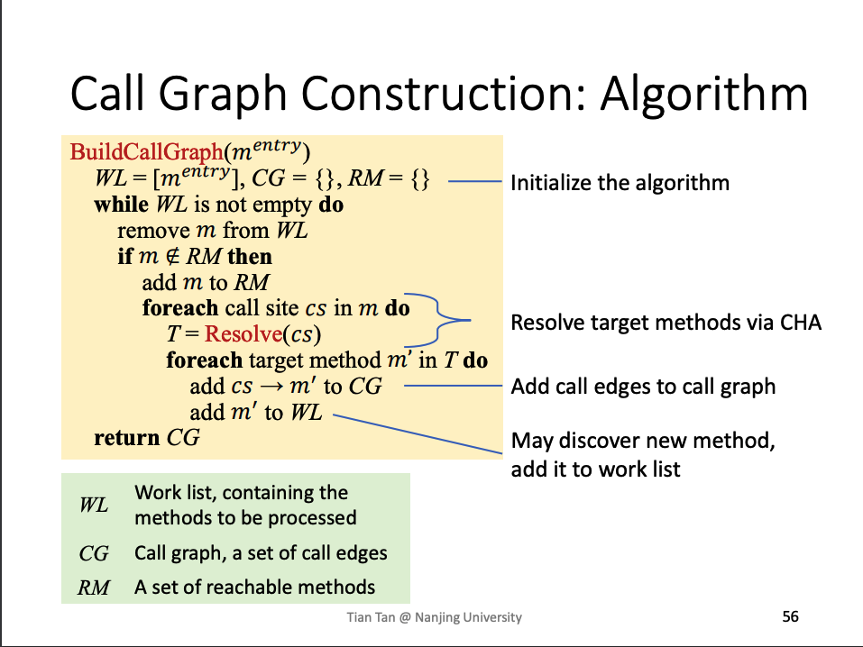

## Interprocedural Control-Flow Graph

###  定义
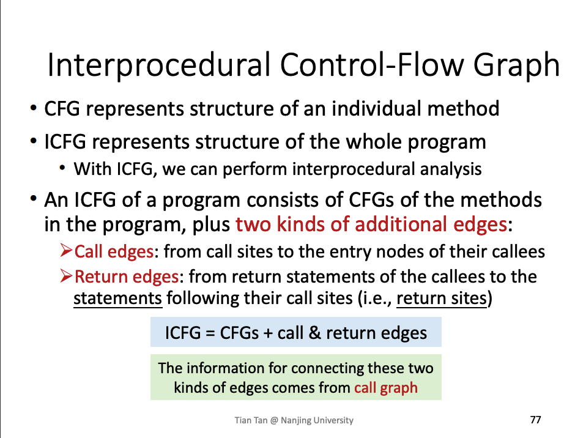

## Interprocedural Data-Flow Analysis
###  过程间分析组成
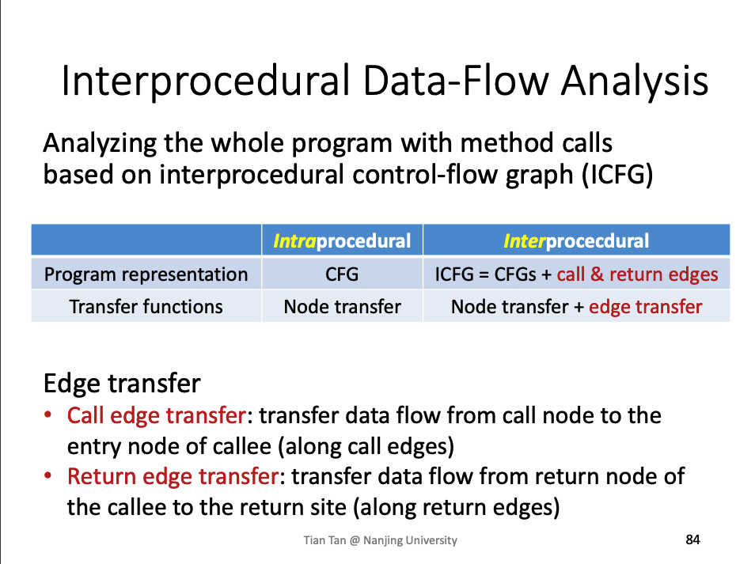

### Interprocedural Constant Propagation
####  组成
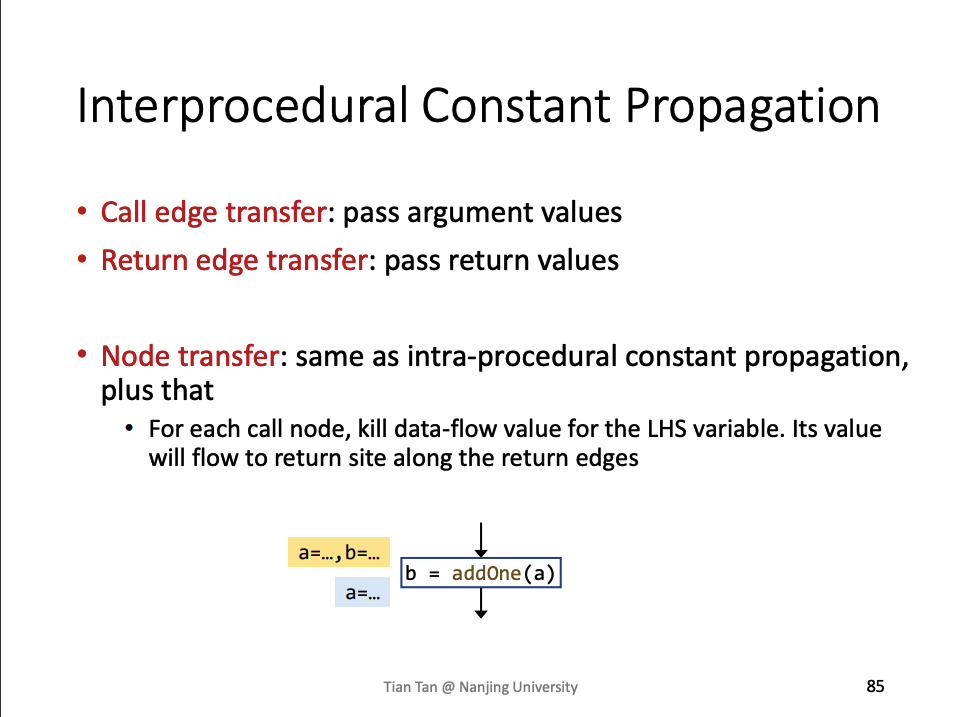

####  栗子
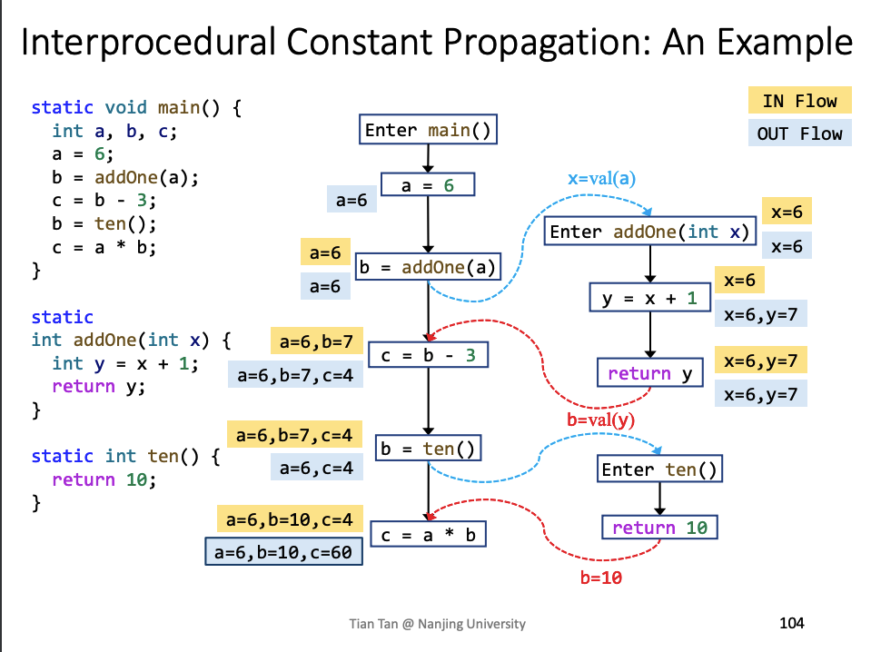
问题:

- 为什保留call set到下条语句的边
  - 是因为这条边用于传播当前函数的常量，免去当前函数中的local var 也通过control flow传递到不必要的函数调用中
- 为什么先要kill掉函数调用的左值
  - 如栗子中b = ten()，如果调用位置通过向下的边传递了b = 7，则与ten函数返回结果进行merge，变成了NAC，错误结果。
