- [Pointer Analysis](#head1)
	- [ Motivation](#head2)
	- [Introduction to Pointer Analysis](#head3)
		- [Pointer Analysis 简述](#head4)
		- [Pointer Analysis 和 Alias Analysis 的区别](#head5)
		- [ 指针分析在静态分析地位](#head6)
	- [Key Factors of Pointer Analysis](#head7)
		- [Pointer Analysis的四个取舍要素](#head8)
		- [Heap Abstraction](#head9)
			- [ 为什么堆抽象](#head10)
			- [Allocation-Site Abstraction](#head11)
		- [Context Sensitivity](#head12)
		- [Flow Sensitivity](#head13)
		- [Analysis Scope](#head14)
		- [ 课程涉及的特性](#head15)
	- [Concerned Statements](#head16)
		- [Pointer Analysis面向的指针类型](#head17)
		- [ Pointer Analysis面向的语句](#head18)
# Pointer Analysis

##  Motivation

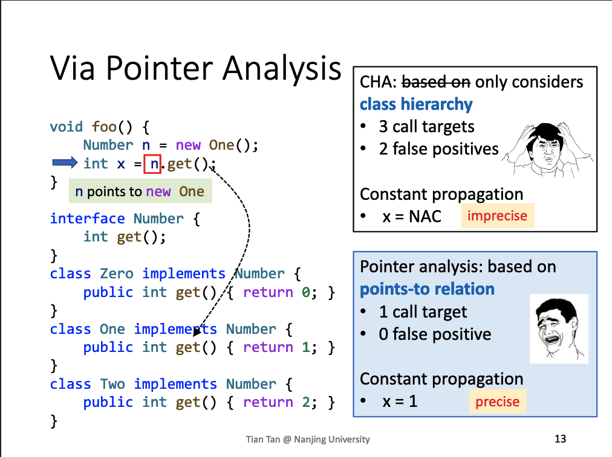

指针分析可以解决之前通过CHA导致的过多误报问题，因为我们可以通过指针分析的值n真正指向的对象。

## Introduction to Pointer Analysis

### Pointer Analysis 简述
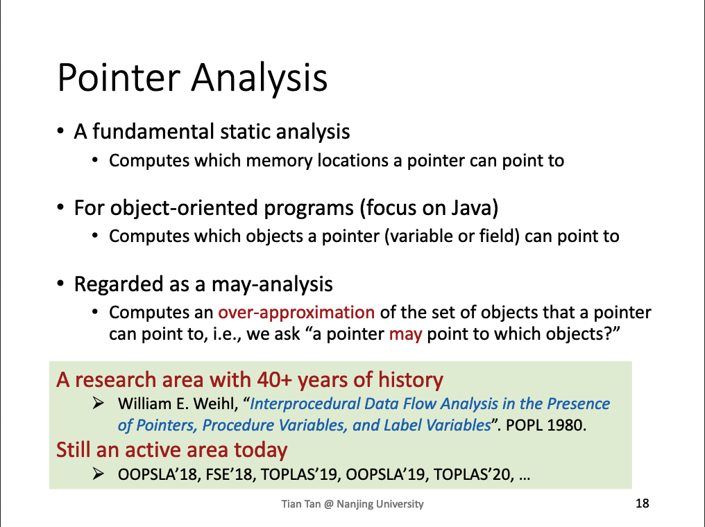

### Pointer Analysis 和 Alias Analysis 的区别
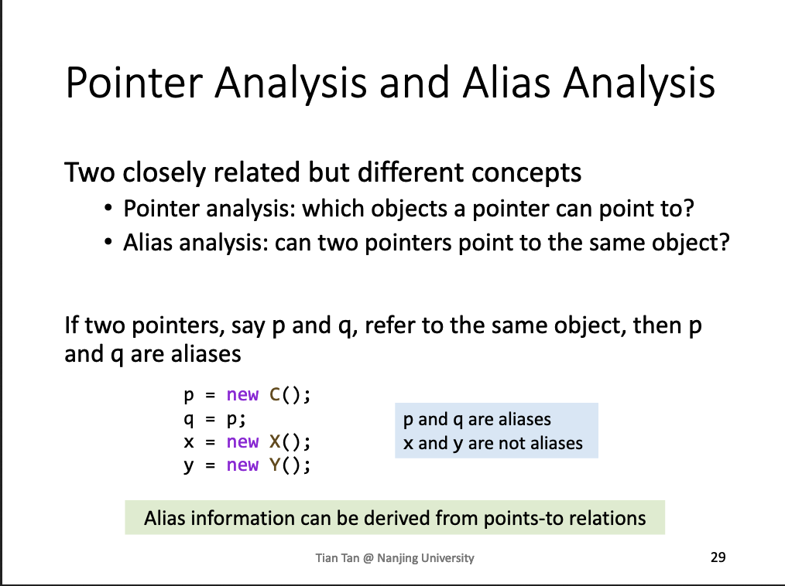
两者可以理解为两个域之间的映射关系，分为两个域：指针域、对象域。
-  Pointer Analysis问题为指针域指向对象域的问题，同一个指针指向了哪些对象。
- Alias Analysis问题是对象域指向指针域的问题，同一个对象指向了哪些指针。

###  指针分析在静态分析地位
Pointer analysis is one of the most fundamenal static program analyses, on which virtually others are built.

## Key Factors of Pointer Analysis
### Pointer Analysis的四个取舍要素
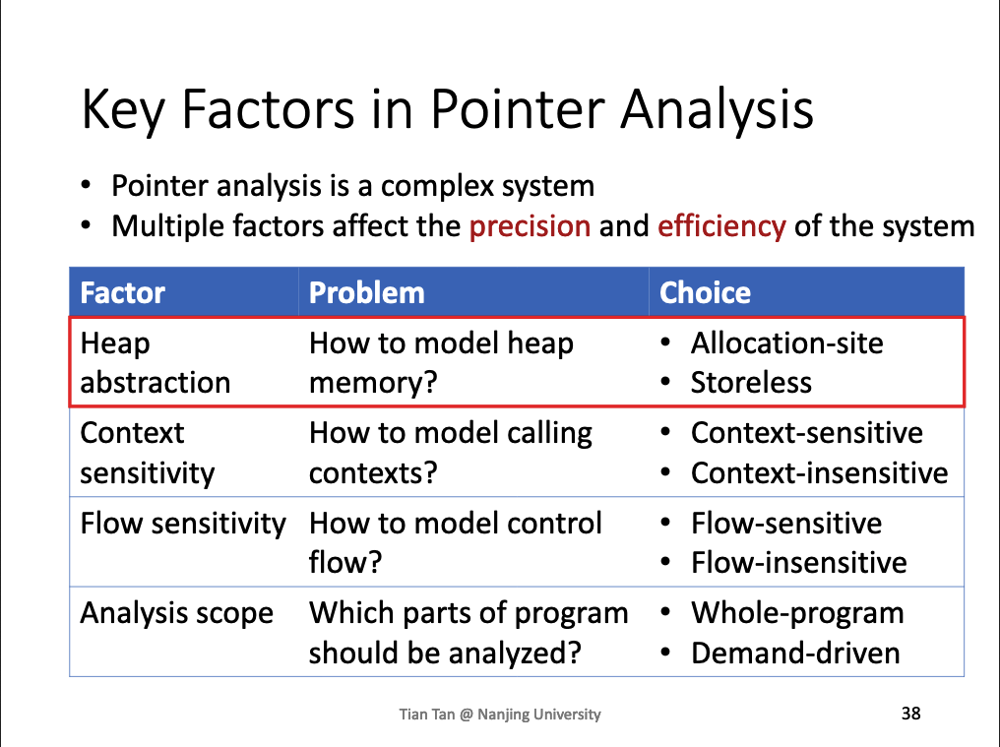

### Heap Abstraction
####  为什么堆抽象
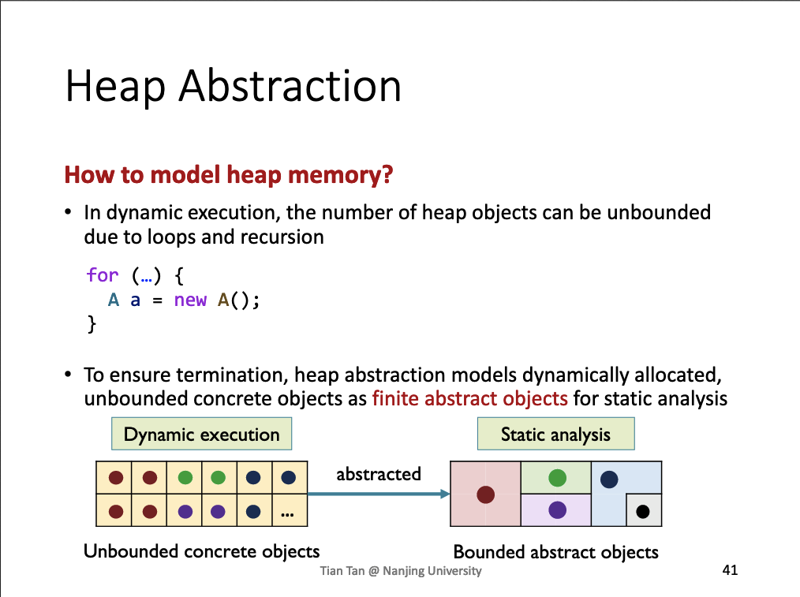

#### Allocation-Site Abstraction
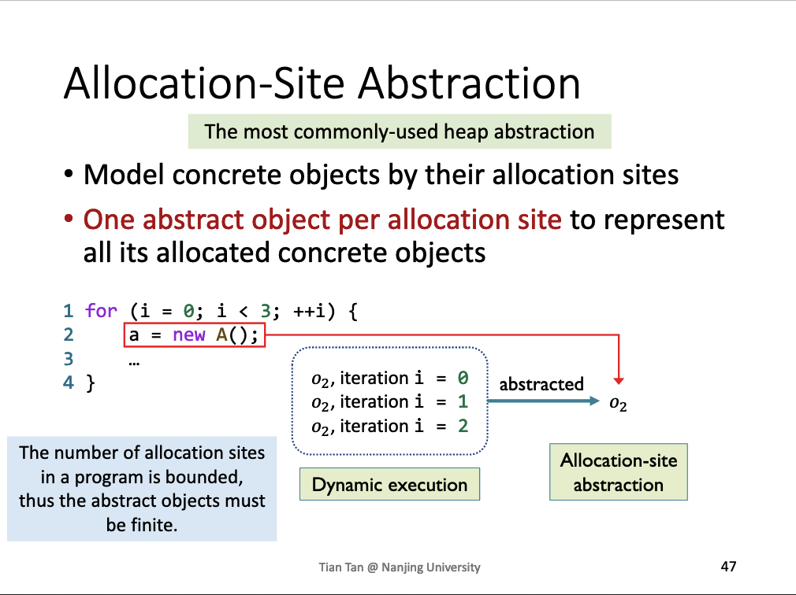

### Context Sensitivity
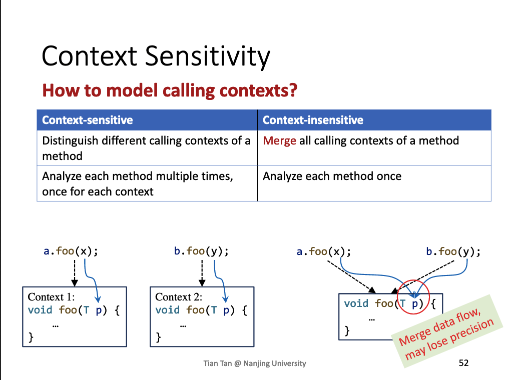

### Flow Sensitivity
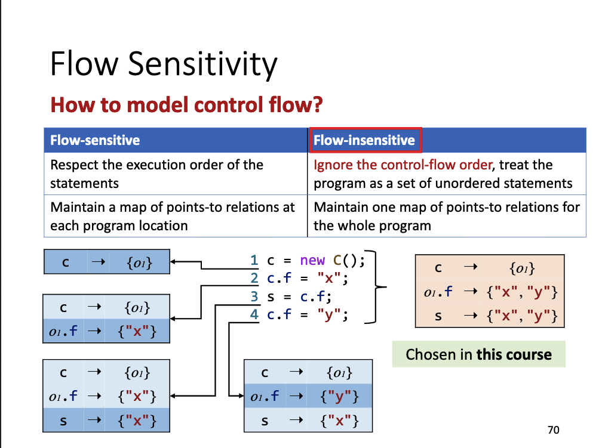

### Analysis Scope
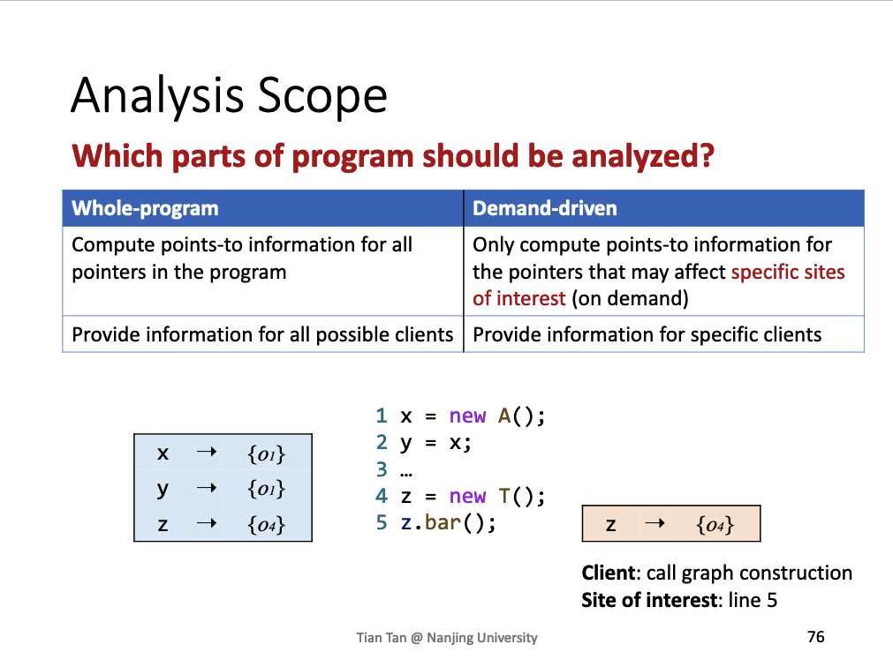

###  课程涉及的特性
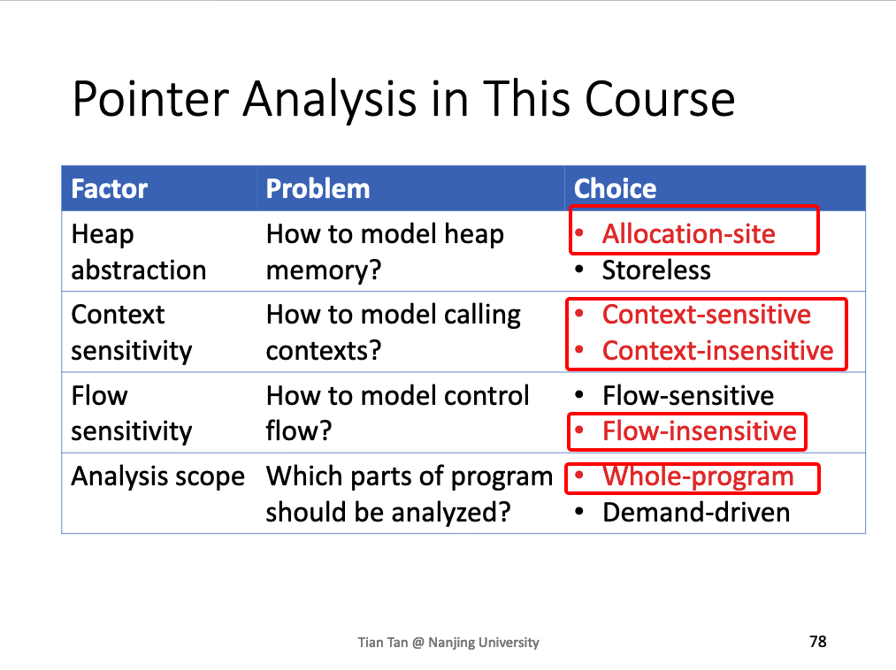
从这里可以大概感觉到对于多数静态分析，更贴近于工程中的问题，对于实现中的细节，没有一个完美统一的解决方案，都是在于各个要素的取舍

## Concerned Statements

### Pointer Analysis面向的指针类型
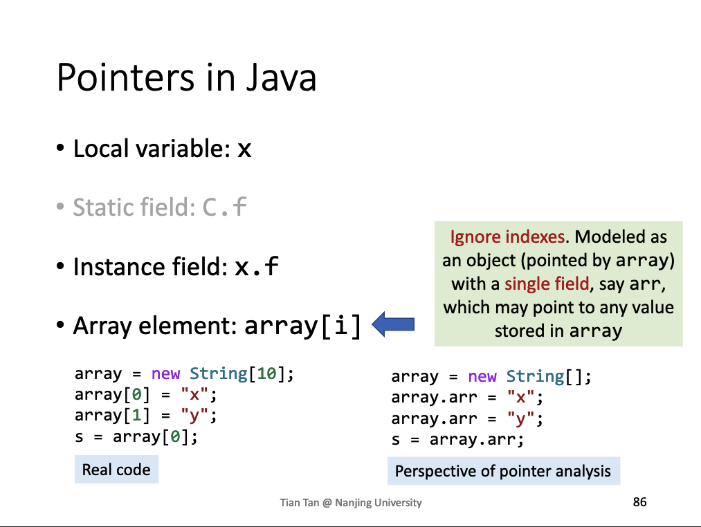
对于array我们直接抽象成Instance field，不区分index

###  Pointer Analysis面向的语句
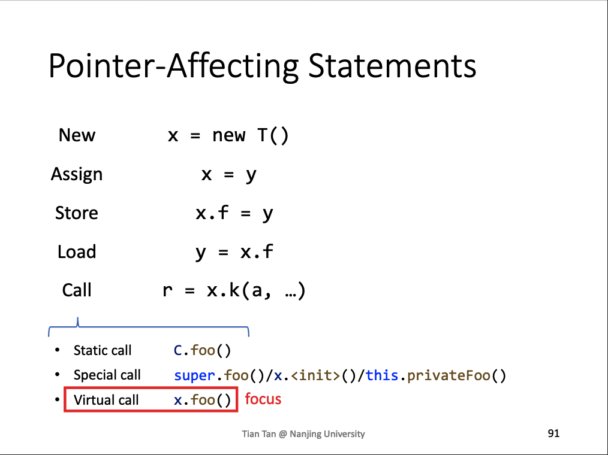
我们学习的时候，主要学习virtual call的分析，static call、special call比较简单。